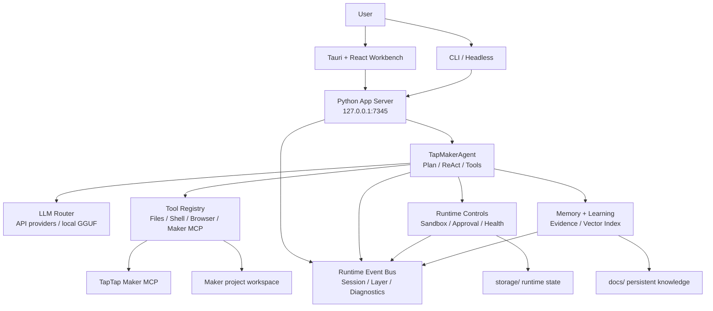

# TTMEvolve

[中文 README](README.zh-CN.md)

TTMEvolve is a desktop AI Agent workbench for TapTap Maker game development. It combines a Tauri + React desktop shell, a local Python App Server, Maker MCP diagnostics, API-first LLM routing, runtime evidence, memory, and learning workflows into one local development cockpit.

## Current Release State

| Item | Status |
| --- | --- |
| Source checkpoint | Ready |
| Version line | `0.4.5-one-click-practice-entry+gui-chat-readable` |
| Primary desktop shell | Tauri 2.x + Rust + WebView2 |
| Frontend | React + Vite workbench |
| Backend | Python App Server on `http://127.0.0.1:7345` |
| LLM runtime | API providers first; local GGUF remains an explicit fallback |
| Maker integration | Maker setup, readiness, tool audit, and MCP reconnect flows |
| Offline runtime bundle | Audited ready after cache cleanup, with portable Node still reported as a warning |
| Full publishable offline release | Partial, not claimed |

The current GitHub state is a stable source release checkpoint. It does not claim a signed installer, Maker remote build smoke, or production RAG semantic-quality proof.

## Quick Start

On Windows, start the desktop GUI:

```powershell
.\start-tauri.bat
```

CLI and headless modes:

```powershell
.\start-tauri.bat --cli
.\start-tauri.bat --headless
```

Backend-only smoke check:

```powershell
python main.py --serve --mock
```

The launcher prefers embedded runtimes under `portable/`, then `.venv/`, then system tools. In a source checkout, if no Tauri binary exists, the launcher builds the frontend and starts Tauri with Cargo.

## What TTMEvolve Provides

- A chat-first desktop Agent surface for TapTap Maker game work.
- Native Maker preview through the Tauri/WebView2 shell.
- Maker MCP setup diagnostics, readiness checks, tool audit, and reconnect support.
- API provider selection and probe evidence for MiniMax, OpenAI-compatible providers, Claude-style providers, and local fallback paths.
- Runtime Readiness, Evidence Bundle, LLM Onboarding, and handoff endpoints for debugging and external Agent collaboration.
- Plan-first Agent execution with sandbox, approval, tool validation, runtime events, and durable session replay.
- Memory and learning evidence with explicit claim gates for deterministic RAG speed versus production embedding quality.

## Architecture



## Repository Map

| Path | Purpose |
| --- | --- |
| `src-tauri/` | Primary Tauri/Rust desktop shell, backend lifecycle, native commands, updater, and bundle config. |
| `frontend/` | React + Vite workbench UI. |
| `server/` | Local App Server, session APIs, evidence/readiness APIs, Maker setup APIs, and browser service. |
| `agent/` | Agent runtime, Plan First, ReAct loop, tool execution, Maker guard, MCP integration, and trajectory helpers. |
| `core/` | Config, sandbox, approval, health, runtime events, contracts, and portable environment checks. |
| `llm/` | LLM providers, router/factory, local GGUF support, and provider presets. |
| `memory/` | Memory manager, AGENTS.md indexing, vector/cold memory, RAG benchmark, and RAG quality evaluation. |
| `learning/` | Trajectory collection, reflection, shared-memory bridge, skill generation, and validation. |
| `ecosystem/` | Cross-agent adapters and skill sync. |
| `electron/` | Legacy Electron compatibility build surface. |
| `tests/` | Python regression and integration tests. |
| `docs/` | Release notes, architecture records, sprint board, memory health, and project knowledge. |

Ignored local/runtime state includes `storage/`, `portable/`, `workspace/`, `vendor/`, `models/`, `node_modules/`, `src-tauri/target/`, `logs/`, `.env*`, `.mcp.json`, and `release-artifacts/`.

## Development Commands

Frontend build:

```powershell
npm.cmd --prefix frontend run build
```

Electron compatibility build:

```powershell
npm.cmd --prefix electron run build
```

Tauri/Rust tests:

```powershell
cargo test --manifest-path src-tauri\Cargo.toml
```

Python tests:

```powershell
.venv\Scripts\python.exe -m pytest -q
```

Release readiness:

```powershell
.venv\Scripts\python.exe scripts\release_readiness.py --mode source-checkpoint --json
.venv\Scripts\python.exe scripts\release_readiness.py --mode full-offline --json
```

Source checkpoint package:

```powershell
.venv\Scripts\python.exe scripts\package_release.py
```

## Latest Verification

The current pushed checkpoint was verified with:

- `.venv\Scripts\python.exe -m pytest -q` -> `748 passed, 14 skipped`
- `npm.cmd --prefix frontend run build` -> passed
- `npm.cmd --prefix electron run build` -> passed with Vite CJS deprecation warnings only
- `cargo test --manifest-path src-tauri\Cargo.toml` -> `34 passed`, warnings only
- `.venv\Scripts\python.exe -m pytest tests\test_package_release.py tests\test_release_readiness.py -q` -> `8 passed`
- `.venv\Scripts\python.exe scripts\release_readiness.py --mode source-checkpoint --json` -> `status=ready`
- `.venv\Scripts\python.exe scripts\release_readiness.py --mode full-offline --json` -> `status=partial`
- `git diff --check` -> passed with existing LF/CRLF warnings only

Source package evidence is written to the generated manifest:

```text
release-artifacts/TTMEvolve-source-v0.4.5-one-click-practice-entry.zip
release-artifacts/TTMEvolve-source-v0.4.5-one-click-practice-entry.zip.manifest.json
```

The package is generated locally and intentionally ignored by Git. Use the manifest as the authoritative source for file count, size, SHA-256, and forbidden-entry evidence.

## Release Boundaries

Ready to claim:

- Stable source checkpoint.
- Visible launch surface exists.
- Source package audit passes.
- Offline runtime bundle audit is ready after guarded portable cache cleanup.

Not yet claimed:

- Signed installer artifacts.
- Maker remote build side-effect smoke.
- Production RAG semantic-quality proof with a real golden corpus and production embedding artifact.

## App Server API

Default local server:

```text
http://127.0.0.1:7345
```

Useful endpoints:

| Method | Path | Purpose |
| --- | --- | --- |
| `GET` | `/health` | Health and runtime status |
| `POST` | `/sessions` | Create an Agent session |
| `GET` | `/sessions/{id}/events` | SSE event stream |
| `POST` | `/sessions/{id}/cancel` | Cancel a session |
| `POST` | `/config/llm` | Update LLM configuration |
| `POST` | `/llm/probe` | Probe configured LLM provider |
| `GET` | `/runtime/readiness` | No-network runtime readiness gate |
| `GET` | `/runtime/portable` | Portable environment diagnostics |
| `GET` | `/maker/setup-status` | Maker setup status |
| `GET` | `/maker/tool-audit` | Maker remote/local tool audit |
| `GET` | `/sessions/{id}/evidence?steps=20` | Compact runtime evidence bundle |
| `GET` | `/agent/onboarding?session_id=...&steps=20` | External Agent onboarding bundle |

## Safety Notes

Do not commit API keys, TapTap Maker auth state, local model files, user caches, build outputs, or private project assets.

Important ignored/private paths:

- `config.json`
- `.env*`
- `.mcp.json`
- `.venv/`
- `node_modules/`
- `storage/`
- `portable/`
- `workspace/`
- `vendor/`
- `models/`
- `logs/`
- `.codex/`
- `.cursor/`
- `release-artifacts/`

## GitHub

Repository:

```text
https://github.com/KingSystemHaiGo/TTMEvolve
```

## License

The Tauri bundle metadata currently declares MIT. Ensure `LICENSE` is present and aligned before public distribution.
