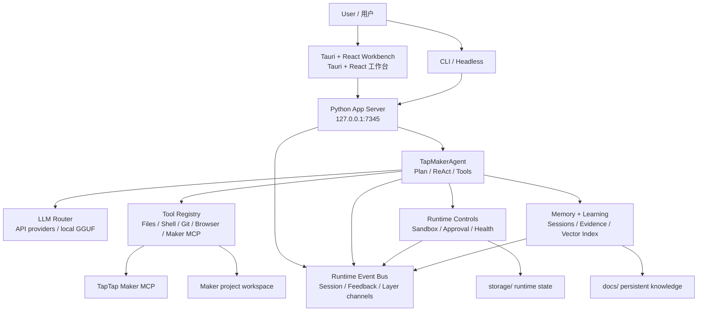

# TTMEvolve

> **Desktop AI Agent workbench for TapTap Maker / 面向 TapTap Maker 的桌面 AI Agent 工作台**

TTMEvolve is a local desktop development system for TapTap Maker game creation. It combines a Tauri + React GUI, a Python App Server, Maker MCP diagnostics, API-first LLM routing, runtime evidence, memory, and learning loops into one workflow.

TTMEvolve 是一个面向 TapTap Maker 游戏开发的本地桌面系统。它把 Tauri + React 图形界面、Python App Server、Maker MCP 诊断、API 优先的 LLM 路由、运行证据、记忆与学习闭环整合到同一个工作流里。

## Current Status / 当前状态

| Item | English | 中文 |
| --- | --- | --- |
| Version | v1.5.1+ desktop readiness build | v1.5.1+ 桌面就绪修复版 |
| Primary desktop shell | Tauri 2.x + Rust + WebView2 | Tauri 2.x + Rust + WebView2 |
| Frontend | React + Vite workbench | React + Vite 工作台 |
| Backend | Python App Server on `http://127.0.0.1:7345` | Python App Server，默认 `http://127.0.0.1:7345` |
| Maker integration | Maker MCP setup, status, tool audit, and reconnect flows | Maker MCP 安装、状态、工具审计与重连流程 |
| LLM runtime | API-first providers, local GGUF as explicit fallback | API Provider 优先，本地 GGUF 作为显式 fallback |
| Legacy shell | `electron/` remains only as a compatibility build surface | `electron/` 仅保留为兼容构建面 |

## Quick Start / 快速开始

Start the desktop GUI on Windows:

在 Windows 上启动桌面 GUI：

```powershell
.\start-tauri.bat
```

CLI and headless modes:

CLI 与无界面模式：

```powershell
.\start-tauri.bat --cli
.\start-tauri.bat --headless
```

Backend-only smoke check:

仅启动后端做烟测：

```powershell
python main.py --serve --mock
```

The launcher prefers embedded runtimes under `portable/`, then `.venv/`, then system tools. In a source checkout, if no Tauri binary exists, the launcher builds the frontend and starts Tauri with Cargo instead of falling back to backend-only Python.

启动器会优先使用 `portable/` 内嵌运行时，然后尝试 `.venv/`，最后使用系统工具。在源码仓库里，如果还没有 Tauri 二进制文件，启动器会先构建前端，再用 Cargo 启动 Tauri，而不是退回到只启动 Python 后端。

## Desktop Behavior / 桌面行为

| Feature | English | 中文 |
| --- | --- | --- |
| Startup gate | The GUI waits for config, `/health`, Maker setup, and Maker MCP status before exposing the workbench. | GUI 会先等待配置、`/health`、Maker setup 和 Maker MCP 状态检查完成，再进入工作台。 |
| Maker routing | If Maker setup or Maker MCP needs attention, the app opens the Maker Access page automatically. | 如果 Maker setup 或 Maker MCP 需要处理，应用会自动打开 Maker 接入页。 |
| Preview | Tauri uses a native child WebView2 for the live, clickable Maker preview; Playwright remains separate for Agent automation. | Tauri 使用原生子 WebView2 作为可点击交互的 Maker 预览；Playwright 仅保留给 Agent 自动化操作。 |
| Permission mode | Each session can choose `safe`, `default`, or `autonomous` in the chat send area. | 每次会话都可以在聊天发送区选择 `safe`、`default` 或 `autonomous` 权限模式。 |
| Chat shape | User messages are right-side bubbles; assistant answers are full-width Markdown pages; tool events are compact status rows. | 用户消息是右侧气泡；助手回复是全宽 Markdown 页面；工具事件是紧凑状态行。 |
| Product polish | History is a dismissible popover; normal users see action progress, not internal tool candidate lists. | 历史记录是可关闭浮层；普通用户只看到动作进度，不看到内部候选工具列表。 |
| Advanced evidence | The Workbench keeps diagnostics available, but visible labels avoid leaking raw candidate-tool wording into the normal product flow. | Workbench 仍保留诊断证据，但可见标签避免把原始候选工具等内部措辞暴露到普通产品流程。 |
| Project status | `project_status` gives the Agent a first-class read-only way to inspect the current project, Git state, and top-level files. | `project_status` 让 Agent 可以用一等只读工具查看当前项目、Git 状态和顶层文件。 |
| Shell commands | `execute_shell` remains selectable for `cmd`, PowerShell, terminal, build, test, and Git-status requests. | `execute_shell` 会稳定覆盖 `cmd`、PowerShell、终端、构建、测试和 Git 状态类请求。 |
| Document creation | `create_document` lets the Agent create Markdown/text/JSON documents through the same sandbox, approval, and event pipeline as code edits. | `create_document` 让 Agent 可以通过和代码编辑相同的沙箱、审批、事件链路新建 Markdown/text/JSON 文档。 |
| Search performance | `search_files` skips heavy/runtime directories and large/binary files, then returns scan metrics. | `search_files` 默认跳过重目录、运行时目录、大文件和二进制文件，并返回扫描指标。 |
| Workspace profile | Tool ranking infers `coding/docs/maker/browser/general` and uses it to narrow candidate tools. | 工具排序会推断 `coding/docs/maker/browser/general` 工作面，并用它收敛候选工具。 |
| Memory context | Workspace profile is passed into memory/context budgeting so RAG can become profile-aware. | 工作面信号已进入记忆/上下文预算，为 RAG 按 profile 加速打基础。 |

## Architecture / 架构



Agent core audit:

Agent 核心审计：

- [Agent Core Health Audit 2026-06-26](docs/architecture/agent-core-health-audit-2026-06-26.md) documents the verified coding-agent loop, layered runtime evidence, safety boundaries, and the remaining gap before any Claude Code/Codex parity claim.
- [Agent Core Health Audit 2026-06-26](docs/architecture/agent-core-health-audit-2026-06-26.md) 记录已验证的编程 Agent 闭环、分层运行证据、安全边界，以及距离 Claude Code/Codex 级别仍需补齐的差距。
- `core/runtime_events.py` now contains a lightweight in-process Runtime Event Bus for typed envelopes, filtered subscribers, bounded replay, and non-breaking observers. It is wired into AppServer sessions while keeping the existing SSE/SQLite event shape compatible.
- `core/runtime_events.py` 现在提供轻量级进程内 Runtime Event Bus，支持统一事件 envelope、过滤订阅、有界回放和观察者异常隔离；它已接入 AppServer 会话，同时保持现有 SSE/SQLite 事件形状兼容。

## Repository Map / 目录结构

| Path | English | 中文 |
| --- | --- | --- |
| `src-tauri/` | Primary Tauri/Rust desktop shell, backend lifecycle, fast ops bridge, commands, updater, bundle config. | 主 Tauri/Rust 桌面壳、后端生命周期、fast ops 桥接、命令、更新器与打包配置。 |
| `frontend/` | React + Vite workbench UI. | React + Vite 工作台 UI。 |
| `server/` | Local App Server, session APIs, Maker setup/status APIs, browser service. | 本地 App Server、会话 API、Maker 设置/状态 API、浏览器服务。 |
| `agent/` | Agent runtime, ReAct loop, tool registry, MCP integration, tool validation. | Agent 运行时、ReAct 循环、工具注册表、MCP 集成、工具校验。 |
| `core/` | Config, sandbox, approval, health, runtime events, portable environment. | 配置、沙箱、审批、健康检查、运行时事件、便携环境。 |
| `llm/` | LLM providers, router/factory, local GGUF support, provider presets. | LLM Provider、路由/工厂、本地 GGUF 支持、Provider 预设。 |
| `memory/` | Memory manager, AGENTS.md parsing/indexing, vector/cold memory. | 记忆管理、AGENTS.md 解析/索引、向量记忆与冷记忆。 |
| `learning/` | Trajectory collection, reflection, skill generation, validation. | 轨迹收集、反思、技能生成与验证。 |
| `ecosystem/` | Cross-agent adapters and skill sync. | 跨 Agent 适配器与技能同步。 |
| `electron/` | Legacy Electron compatibility build surface. | 旧 Electron 兼容构建面。 |
| `tests/` | Python regression tests. | Python 回归测试。 |
| `docs/` | Release notes, architecture notes, memory, roadmaps, session knowledge. | 发布说明、架构笔记、记忆、路线图与会话知识。 |
| `workspace/`, `portable/`, `storage/`, `vendor/`, `models/` | Ignored local/runtime state. | 被 Git 忽略的本地/运行时状态。 |

## Development Commands / 开发命令

Frontend build:

前端构建：

```powershell
npm.cmd --prefix frontend run build
```

Electron compatibility build:

Electron 兼容构建：

```powershell
npm.cmd --prefix electron run build
```

Tauri/Rust tests:

Tauri/Rust 测试：

```powershell
cargo test --manifest-path src-tauri/Cargo.toml
```

Python tests:

Python 测试：

```powershell
.venv\Scripts\python.exe -m pytest -q
```

Real local GGUF smoke tests are opt-in:

真实本地 GGUF 烟测需要显式开启：

```powershell
$env:TTMEVOLVE_RUN_REAL_LOCAL_LLM = "1"
.venv\Scripts\python.exe -m pytest tests/test_local_llm.py -q
```

## Latest Verification / 最新验证

The latest full sync validated these paths:

最近一次完整同步已验证：

- `npm.cmd --prefix frontend run build` -> passed after history close affordance and Workbench label polish
- `.venv\Scripts\python.exe -m pytest tests\test_tool_call_validation.py::test_tool_registry_prioritizes_project_status_for_project_questions tests\test_tool_call_validation.py::test_tool_registry_keeps_project_and_shell_tools_for_basic_project_work tests\test_tool_call_validation.py::test_tool_registry_keeps_shell_tool_for_cmd_and_terminal_requests tests\test_tool_call_validation.py::test_tool_registry_does_not_let_maker_tools_crowd_out_basic_project_work -q` -> `4 passed`
- `.venv\Scripts\python.exe -m pytest tests\test_tool_call_validation.py tests\test_shared_memory_policy.py tests\test_app_server_resume.py::test_app_server_evidence_bundle_endpoint -q` -> `37 passed`
- `.venv\Scripts\python.exe -m pytest tests\test_runtime_events.py tests\test_app_server_resume.py::test_session_emit_publishes_to_runtime_event_bus_and_store tests\test_app_server_resume.py::test_app_server_sessions_share_runtime_event_bus -q` -> `7 passed`
- `.venv\Scripts\python.exe -m pytest tests\test_tool_call_validation.py tests\test_sandbox.py -q` -> `25 passed`
- `.venv\Scripts\python.exe -m pytest tests\test_tool_call_validation.py::test_coding_agent_minimal_programming_smoke -q` -> `1 passed`
- `.venv\Scripts\python.exe -m pytest tests\test_tool_call_validation.py::test_coding_agent_can_create_user_document -q` -> `1 passed`
- `.venv\Scripts\python.exe -m pytest tests\test_tool_call_validation.py::test_executor_search_files_skips_heavy_dirs_and_large_files -q` -> `1 passed`
- `.venv\Scripts\python.exe -m pytest tests\test_tool_call_validation.py tests\test_sandbox.py tests\test_tool_timeouts.py tests\test_plan_first.py tests\test_plan_first_integration.py tests\test_plan_validation.py tests\test_coding_agent_v060.py tests\test_runtime_events.py tests\test_runtime_contract.py -q` -> `89 passed`
- `.venv\Scripts\python.exe -m pytest tests\test_memory_manager.py tests\test_tool_call_validation.py tests\test_sandbox.py tests\test_tool_timeouts.py tests\test_plan_first.py tests\test_plan_first_integration.py tests\test_plan_validation.py tests\test_coding_agent_v060.py tests\test_runtime_events.py tests\test_runtime_contract.py -q` -> `95 passed`
- `.venv\Scripts\python.exe -m pytest -q` -> `598 passed, 14 skipped`
- `npm.cmd --prefix frontend run build` -> passed
- `npm.cmd --prefix electron run build` -> passed
- `cargo test --manifest-path src-tauri/Cargo.toml` -> `34 passed`
- `.venv\Scripts\python.exe -m pytest tests/test_start_scripts.py tests/test_tauri_lifecycle.py -q` -> `28 passed`
- Real `TTMEvolve.vbs` launch opened one visible TTMEvolve window with no visible cmd/powershell windows.
- `/health` returned `status=ok`; child-window enumeration showed both the TTMEvolve shell WebView and the TapTap Maker preview WebView.

## Maker MCP Rules / Maker MCP 规则

- `maker_mcp.cwd` must point to a real Maker game project, not the TTMEvolve app root.  
  `maker_mcp.cwd` 必须指向真实 Maker 游戏项目，而不是 TTMEvolve 应用根目录。
- Relative config paths are resolved from the config file location.  
  相对配置路径按 config 文件所在位置解析。
- `TAPTAP_MAKER_HOME` is the official Maker auth/home variable; `TTM_MAKER_HOME` is mirrored for compatibility.  
  `TAPTAP_MAKER_HOME` 是官方 Maker 认证/主目录变量；`TTM_MAKER_HOME` 作为兼容镜像。
- Empty, `0`, `none`, `null`, or `undefined` Maker project ids are treated as not bound.  
  空值、`0`、`none`、`null`、`undefined` 的 Maker project id 都视为未绑定。

## App Server API / App Server API

Default local server:

默认本地服务：

```text
http://127.0.0.1:7345
```

| Method | Path | English | 中文 |
| --- | --- | --- | --- |
| `GET` | `/health` | Health and runtime status | 健康与运行时状态 |
| `POST` | `/sessions` | Create an Agent session | 创建 Agent 会话 |
| `GET` | `/sessions/{id}/events` | SSE event stream | SSE 事件流 |
| `POST` | `/sessions/{id}/cancel` | Cancel session | 取消会话 |
| `POST` | `/config/llm` | Update LLM configuration | 更新 LLM 配置 |
| `POST` | `/llm/probe` | Probe configured LLM provider | 探测已配置的 LLM Provider |
| `GET` | `/maker/setup-status` | Maker setup status | Maker 设置状态 |
| `GET` | `/maker/tool-audit` | Maker remote/local tool audit | Maker 远端/本地工具审计 |
| `POST` | `/maker/repair` | Hot repair Maker access | 热修复 Maker 接入 |
| `GET` | `/runtime/readiness` | No-network runtime readiness gate | 无网络运行时就绪门 |
| `GET` | `/runtime/portable` | Portable environment diagnostics | 便携环境诊断 |
| `GET` | `/sessions/{id}/evidence?steps=20` | Compact runtime evidence bundle | 紧凑运行证据包 |

## Data And Safety Boundaries / 数据与安全边界

Do not commit local/private runtime state:

不要提交本地或私有运行时状态：

- `config.json`
- `.env*`
- `.venv/`
- `node_modules/`
- `storage/`
- `portable/`
- `workspace/`
- `vendor/`
- `models/`
- `logs/`
- `.codex/`
- `.cursor/`
- `.mcp.json`
- generated shortcuts and local build artifacts / 生成的快捷方式与本地构建产物

Never commit API keys, TapTap Maker auth state, local model files, user caches, build outputs, or private project assets.

不要提交 API keys、TapTap Maker 登录状态、本地模型文件、用户缓存、构建产物或真实项目里的私有素材。

## Troubleshooting / 排障

If the GUI opens but runtime state looks wrong, check:

如果 GUI 能打开但运行状态异常，先检查：

```powershell
Invoke-RestMethod http://127.0.0.1:7345/health
Invoke-RestMethod http://127.0.0.1:7345/maker/setup-status
Invoke-RestMethod http://127.0.0.1:7345/maker/tool-audit
Invoke-RestMethod http://127.0.0.1:7345/mcp/status
```

If a provider is configured but you need proof it is actually called, use `/llm/probe` and inspect endpoint, token, and latency evidence. MiniMax should show `/text/chatcompletion_v2`; OpenAI-compatible providers should show `/chat/completions`; Claude should show `/messages`.

如果已配置 Provider，但需要证明它真的被调用，请使用 `/llm/probe` 并检查 endpoint、token 和 latency 证据。MiniMax 应出现 `/text/chatcompletion_v2`；OpenAI-compatible Provider 应出现 `/chat/completions`；Claude 应出现 `/messages`。

## GitHub / GitHub

Repository:

仓库：

```text
https://github.com/KingSystemHaiGo/TTMEvolve
```

Release gate for a broad sync:

大范围同步前的发布门：

```powershell
.venv\Scripts\python.exe -m pytest -q
npm.cmd --prefix frontend run build
npm.cmd --prefix electron run build
cargo test --manifest-path src-tauri/Cargo.toml
```

## License / 许可证

The Tauri bundle metadata currently declares MIT. Ensure `LICENSE` is present and aligned before public distribution.

Tauri 打包元数据当前声明为 MIT。公开分发前，请确保 `LICENSE` 文件存在并与发布策略一致。
