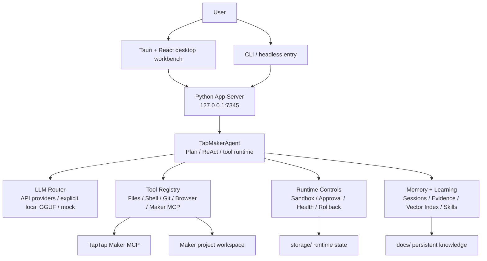

# TTMEvolve

> **v1.5.1 full validation pass**: Tauri 2.x + Rust + WebView2 desktop shell, React workbench, Python App Server, cloud/API LLM routing, Maker MCP integration, and cross-stack release validation.

TTMEvolve is a desktop AI development workbench for TapTap Maker projects. It is designed to connect project understanding, Maker MCP tools, code edits, build verification, runtime evidence, memory, and learning into one local system.

The current primary GUI is **Tauri + React**. The Python backend provides the App Server, session runtime, Maker setup APIs, LLM routing, sandbox/approval controls, and learning/memory services. The legacy Electron package is kept as a compatibility/build surface, not the normal user entry.

## Current Status

- **Latest synced release work**: `v1.5.1: full validation bugfix pass`
- **Latest pushed commit**: `a3e7626`
- **Python tests**: `598 passed, 14 skipped`
- **Rust/Tauri tests**: `32 passed`
- **Frontend build**: passed
- **Electron compatibility build**: passed
- **Default test scope**: `pytest.ini` limits collection to `tests/` and skips runtime state directories such as `portable/`, `storage/`, `workspace/`, and `vendor/`

## Highlights

- **Tauri desktop shell**: Rust + WebView2 with lifecycle management for the Python backend and fast_ops bridge.
- **React workbench**: chat-first Agent UI, Maker preview surface, setup/settings/tool panels, runtime evidence, and diagnostics.
- **Python App Server**: local HTTP/SSE runtime for sessions, files, browser tooling, Maker setup, LLM probes, and evidence bundles.
- **API-first LLM runtime**: provider routing for OpenAI-compatible APIs, Claude, DeepSeek, Qwen, Zhipu, Moonshot, SiliconFlow, MiniMax, and explicit local GGUF fallback.
- **Maker MCP integration**: project selection, setup doctor, tool audit, auth/home isolation, and remote Maker tool registration.
- **Controlled execution**: sandbox modes, approval profiles, tool validation, structured runtime events, rollback/version helpers, and compact diagnostics.
- **Memory and learning**: session evidence, vector/cold memory, skill sync, async reflection, and persistent runtime lessons.

## Quick Start

On Windows, use the visible launcher or run:

```powershell
.\start-tauri.bat
```

CLI/headless modes use the same launcher:

```powershell
.\start-tauri.bat --cli
.\start-tauri.bat --headless
```

For a backend-only smoke run:

```powershell
python main.py --serve --mock
```

The launcher prefers embedded runtimes under `portable/`, then `.venv/`, then system tools. Normal user-facing launch should stay GUI-first; batch and PowerShell scripts are bootstrap details.

## Architecture



## Repository Map

| Path | Purpose |
| --- | --- |
| `src-tauri/` | Primary Tauri/Rust desktop shell, app lifecycle, fast_ops bridge, commands, updater, bundle config |
| `frontend/` | React + Vite workbench UI |
| `server/` | Local App Server, session APIs, Maker setup/status APIs, browser service |
| `agent/` | Agent runtime, ReAct loop, tool registry, MCP integration, tool validation |
| `core/` | Config, sandbox, approval, health, runtime events, portable environment, updater client |
| `llm/` | LLM providers, router/factory, local GGUF support, provider presets |
| `memory/` | Memory manager, AGENTS.md parsing/indexing, vector/cold memory |
| `learning/` | Trajectory collection, reflection, skill generation/validation |
| `ecosystem/` | Cross-agent adapters and skill sync |
| `electron/` | Legacy Electron compatibility/build surface |
| `scripts/` | Bootstrap, packaging, diagnostics, portable runtime helpers |
| `tests/` | Python regression tests |
| `docs/` | Release notes, architecture notes, memory, roadmaps, session knowledge |
| `workspace/` | Ignored default Maker project workspace |
| `portable/` | Ignored portable runtime home/cache/temp/auth state |
| `storage/` | Ignored runtime/session state |
| `vendor/` | Ignored optional embedded dependencies |
| `models/` | Ignored local GGUF/model files |

## Requirements

For development from source:

- Windows 10/11 for the primary WebView2 GUI path
- Python 3.10+
- Node.js 18+
- Rust toolchain with Cargo
- Git
- npm package source access

For Maker work:

- TapTap Maker account and Maker MCP authorization
- A real Maker project directory, usually under `workspace/default-maker-project` or another selected project directory

For real LLM execution:

- A configured API provider/key, or
- An explicit local GGUF setup

`mock` is for tests and offline smoke checks. Normal GUI execution should use a real provider or fail clearly as unconfigured.

## Configuration

On first startup, `config.example.json` can be copied to `config.json`. `config.json` is local/private and ignored by Git.

Minimal test configuration:

```json
{
  "llm": {
    "provider": "mock"
  },
  "project_root": "./workspace/default-maker-project",
  "storage_root": "./storage",
  "sandbox": {
    "mode": "workspace-write"
  },
  "approval": {
    "policy": "on-request"
  }
}
```

Maker MCP configuration should point at the actual Maker game project, not the TTMEvolve app root:

```json
{
  "maker_mcp": {
    "command": "cmd.exe",
    "args": [
      "/d",
      "/s",
      "/c",
      "npx.cmd",
      "-y",
      "-p",
      "@taptap/maker",
      "taptap-maker"
    ],
    "cwd": "./workspace/default-maker-project",
    "env": {
      "TAPTAP_MCP_ENV": "production",
      "TAPTAP_MAKER_HOME": "./portable/taptap-maker",
      "TTM_MAKER_HOME": "./portable/taptap-maker"
    },
    "request_timeout_seconds": 30
  },
  "project_root": "./workspace/default-maker-project"
}
```

Important Maker rules:

- `maker_mcp.cwd` and relative config paths are config-file-relative.
- `TAPTAP_MAKER_HOME` is the official Maker auth/home variable; `TTM_MAKER_HOME` is mirrored for compatibility.
- Empty, `0`, `none`, `null`, or `undefined` Maker project ids are treated as not bound.

## Development Commands

Frontend build:

```powershell
npm.cmd --prefix frontend run build
```

Legacy Electron compatibility build:

```powershell
npm.cmd --prefix electron run build
```

Tauri/Rust tests:

```powershell
cargo test --manifest-path src-tauri/Cargo.toml
```

Tauri development shell, when the Tauri CLI is available:

```powershell
cd src-tauri
cargo tauri dev
```

Python tests:

```powershell
.venv\Scripts\python.exe -m pytest -q
```

Real local GGUF smoke tests are opt-in because they are slow and machine-dependent:

```powershell
$env:TTMEVOLVE_RUN_REAL_LOCAL_LLM = "1"
.venv\Scripts\python.exe -m pytest tests/test_local_llm.py -q
```

## App Server API

Default local server:

```text
http://127.0.0.1:7345
```

Common endpoints:

| Method | Path | Purpose |
| --- | --- | --- |
| `GET` | `/health` | Health and runtime status |
| `POST` | `/sessions` | Create an Agent session |
| `GET` | `/sessions/{id}/events` | SSE event stream |
| `GET` | `/sessions/{id}/status` | Session status |
| `POST` | `/sessions/{id}/cancel` | Cancel session |
| `POST` | `/config/llm` | Update LLM configuration |
| `POST` | `/llm/probe` | Probe configured LLM provider |
| `GET` | `/tools` | List available Agent tools |
| `POST` | `/maker/project/select` | Select Maker project |
| `POST` | `/maker/practice/start` | Start Maker practice/setup flow |
| `GET` | `/maker/setup-status` | Maker setup status |
| `GET` | `/maker/tool-audit` | Maker remote/local tool audit |
| `GET` | `/runtime/readiness` | No-network runtime readiness gate |
| `GET` | `/runtime/portable` | Portable environment diagnostics |
| `GET` | `/sessions/{id}/evidence?steps=20` | Compact runtime evidence bundle |
| `GET` | `/sessions/{id}/evidence.md?steps=20` | Pasteable evidence Markdown |

## Data And Safety Boundaries

Do not commit local/private runtime state:

- `config.json`
- `.env*`
- `.venv/`
- `node_modules/`
- `storage/`
- `portable/`
- `workspace/`
- `vendor/`
- `models/`
- `logs/`
- `.codex/`
- `.cursor/`
- `.mcp.json`
- generated shortcuts and local build artifacts

Never commit API keys, TapTap Maker auth state, local model files, user caches, build outputs, or private project assets.

## Troubleshooting

If the backend must be checked without GUI:

```powershell
python main.py --serve --mock
```

If a provider is configured but you need proof it is actually called, use `/llm/probe` and inspect endpoint/tokens/latency evidence. MiniMax should show `/text/chatcompletion_v2`; OpenAI-compatible providers should show `/chat/completions`; Claude should show `/messages`.

If Maker tools are missing:

1. Check `GET /runtime/portable` for home/cache/temp leaks.
2. Check `GET /maker/setup-status`.
3. Check `GET /maker/tool-audit`.
4. Confirm the active Maker project has a real bound project id and `.project/settings.json`.
5. Confirm both `TAPTAP_MAKER_HOME` and `TTM_MAKER_HOME` are set.

If tests unexpectedly scan runtime state, confirm `pytest.ini` is present and `testpaths = tests` is active.

## GitHub

Repository:

```text
https://github.com/KingSystemHaiGo/TTMEvolve
```

Current release gate for a broad sync:

```powershell
.venv\Scripts\python.exe -m pytest -q
npm.cmd --prefix frontend run build
npm.cmd --prefix electron run build
cargo test --manifest-path src-tauri/Cargo.toml
```

## License

The Tauri bundle metadata currently declares MIT. Ensure `LICENSE` is present and aligned before public distribution.
