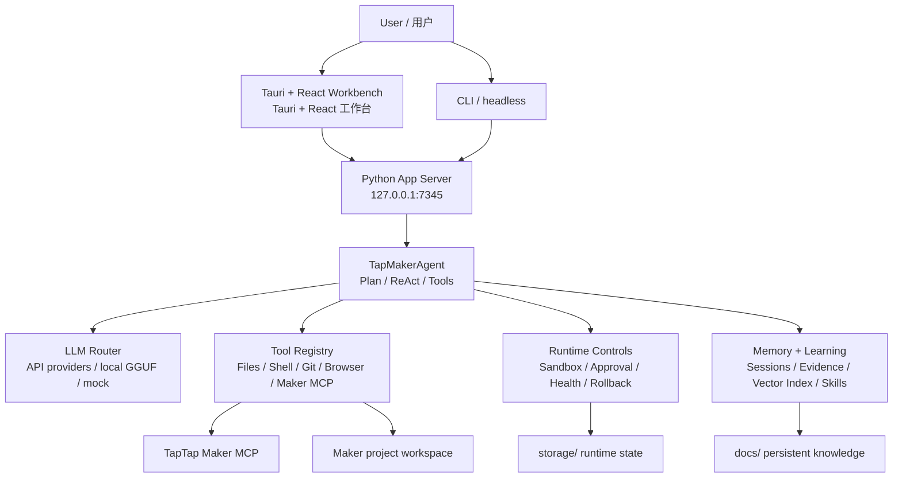

# TTMEvolve

> **v1.5.1+ desktop readiness build / 桌面就绪修复版**  
> Tauri 2.x + Rust + WebView2 desktop shell, React workbench, Python App Server, Maker MCP diagnostics, API-first LLM routing, and startup readiness gates.  
> Tauri 2.x + Rust + WebView2 桌面壳、React 工作台、Python App Server、Maker MCP 诊断、API-first LLM 路由，以及启动就绪门。

TTMEvolve is a desktop AI Agent workbench for TapTap Maker game development. It connects project understanding, Maker MCP tools, code edits, build verification, runtime evidence, memory, and learning into one local development system.

TTMEvolve 是一个面向 TapTap Maker 游戏开发的桌面 AI Agent 工作台。它把项目理解、Maker MCP 工具调用、代码修改、构建验证、运行时证据、记忆沉淀和学习反馈连接成一个本地开发系统。

The primary desktop shell is **Tauri + React**. The legacy `electron/` package remains only as a compatibility build surface.

当前主桌面壳是 **Tauri + React**。旧 `electron/` 包只保留为兼容构建面，不是正常用户入口。

## Current Status / 当前状态

- **Desktop entry / 桌面入口**: `.\start-tauri.bat`
- **Default App Server / 默认后端端口**: `http://127.0.0.1:7345`
- **Startup behavior / 启动行为**: the GUI waits for config, health, Maker setup, and Maker MCP status before exposing the workbench.  
  GUI 会先等待 config、health、Maker setup、Maker MCP 状态检查完成，再进入工作台。
- **Maker issue routing / Maker 问题路由**: if Maker setup or Maker MCP is not ready, the app opens the Maker Access page automatically.  
  如果 Maker setup 或 Maker MCP 未就绪，应用会自动打开 Maker 接入页。
- **Preview surface / 预览器**: Electron uses BrowserView; Tauri uses WebView2/iframe preview with screenshot diagnostics fallback.  
  Electron 使用 BrowserView；Tauri 使用 WebView2/iframe 预览，并保留截图诊断 fallback。
- **Permission mode / 权限模式**: the message input area lets users choose `safe`, `default`, or `autonomous` per session.  
  消息发送区可为每次会话选择 `safe`、`default` 或 `autonomous` 权限模式。

Recent verification:

- `npm.cmd --prefix frontend run build` passed.
- `npm.cmd --prefix electron run build` passed.
- `cargo test --manifest-path src-tauri/Cargo.toml` passed with 32 Rust tests.
- `.venv\Scripts\python.exe -m pytest tests/test_start_scripts.py tests/test_tauri_lifecycle.py -q` passed with 26 Python tests.
- Real `start-tauri.bat` launch produced a responding `TTMEvolve` window, `/health` returned `status=ok`, Maker setup returned `readiness=ready`, and Maker MCP returned `connected=true`, `tool_count=10`.

## Quick Start / 快速开始

Windows:

```powershell
.\start-tauri.bat
```

CLI/headless modes:

```powershell
.\start-tauri.bat --cli
.\start-tauri.bat --headless
```

Backend-only smoke check:

```powershell
python main.py --serve --mock
```

The launcher prefers embedded runtimes under `portable/`, then `.venv/`, then system tools. In a source checkout, if no Tauri binary exists, the launcher builds the frontend and starts Tauri with Cargo instead of falling back to backend-only Python.

启动器会优先使用 `portable/` 内嵌运行时，然后尝试 `.venv/`，最后使用系统工具。在源码仓库中，如果没有已编译 Tauri binary，启动器会构建前端并用 Cargo 启动 Tauri，而不是退回只启动 Python 后端。

## Architecture / 架构



## Repository Map / 目录结构

| Path | Purpose |
| --- | --- |
| `src-tauri/` | Primary Tauri/Rust desktop shell, backend lifecycle, fast_ops bridge, commands, updater, bundle config. 主 Tauri/Rust 桌面壳、后端生命周期、fast_ops bridge、commands、updater、bundle config。 |
| `frontend/` | React + Vite workbench UI. React + Vite 工作台 UI。 |
| `server/` | Local App Server, session APIs, Maker setup/status APIs, browser service. 本地 App Server、会话 API、Maker 设置/状态 API、浏览器服务。 |
| `agent/` | Agent runtime, ReAct loop, tool registry, MCP integration, tool validation. Agent 运行时、ReAct loop、工具注册、MCP 集成、工具校验。 |
| `core/` | Config, sandbox, approval, health, runtime events, portable environment. 配置、沙箱、审批、健康、运行时事件、portable 环境。 |
| `llm/` | LLM providers, router/factory, local GGUF support, provider presets. LLM providers、router/factory、本地 GGUF、provider presets。 |
| `memory/` | Memory manager, AGENTS.md parsing/indexing, vector/cold memory. 记忆管理、AGENTS.md 解析/索引、向量/冷记忆。 |
| `learning/` | Trajectory collection, reflection, skill generation/validation. 轨迹收集、反思、技能生成/验证。 |
| `ecosystem/` | Cross-agent adapters and skill sync. 跨 Agent adapter 与 skill sync。 |
| `electron/` | Legacy Electron compatibility build surface. 旧版 Electron 兼容构建面。 |
| `tests/` | Python regression tests. Python 回归测试。 |
| `docs/` | Release notes, architecture notes, memory, roadmaps, session knowledge. 发布、架构、记忆、路线图、会话知识。 |
| `workspace/`, `portable/`, `storage/`, `vendor/`, `models/` | Ignored local/runtime state. 被 Git 忽略的本地/运行时状态。 |

## Development Commands / 开发命令

Frontend build:

```powershell
npm.cmd --prefix frontend run build
```

Electron compatibility build:

```powershell
npm.cmd --prefix electron run build
```

Tauri/Rust tests:

```powershell
cargo test --manifest-path src-tauri/Cargo.toml
```

Python tests:

```powershell
.venv\Scripts\python.exe -m pytest -q
```

Real local GGUF smoke tests are opt-in:

```powershell
$env:TTMEVOLVE_RUN_REAL_LOCAL_LLM = "1"
.venv\Scripts\python.exe -m pytest tests/test_local_llm.py -q
```

## Maker MCP Rules / Maker MCP 规则

- `maker_mcp.cwd` must point to a real Maker game project, not the TTMEvolve app root.  
  `maker_mcp.cwd` 必须指向真实 Maker 游戏项目，而不是 TTMEvolve 应用根目录。
- Relative config paths are resolved from the config file location.  
  相对配置路径按 config 文件位置解析。
- `TAPTAP_MAKER_HOME` is the official Maker auth/home variable; `TTM_MAKER_HOME` is mirrored for compatibility.  
  `TAPTAP_MAKER_HOME` 是官方 Maker auth/home 变量；`TTM_MAKER_HOME` 作为兼容镜像。
- Empty, `0`, `none`, `null`, or `undefined` Maker project ids are treated as not bound.  
  空值、`0`、`none`、`null`、`undefined` 的 Maker project id 都视为未绑定。

## App Server API

Default local server:

```text
http://127.0.0.1:7345
```

Common endpoints:

| Method | Path | Purpose / 说明 |
| --- | --- | --- |
| `GET` | `/health` | Health and runtime status / 健康与运行时状态 |
| `POST` | `/sessions` | Create an Agent session / 创建 Agent 会话 |
| `GET` | `/sessions/{id}/events` | SSE event stream / SSE 事件流 |
| `POST` | `/sessions/{id}/cancel` | Cancel session / 取消会话 |
| `POST` | `/config/llm` | Update LLM configuration / 更新 LLM 配置 |
| `POST` | `/llm/probe` | Probe configured LLM provider / 探测 LLM provider |
| `GET` | `/maker/setup-status` | Maker setup status / Maker 设置状态 |
| `GET` | `/maker/tool-audit` | Maker remote/local tool audit / Maker 工具审计 |
| `POST` | `/maker/repair` | Hot repair Maker access / 热修复 Maker 接入 |
| `GET` | `/runtime/readiness` | No-network runtime readiness gate / 无网络 readiness gate |
| `GET` | `/runtime/portable` | Portable environment diagnostics / portable 环境诊断 |
| `GET` | `/sessions/{id}/evidence?steps=20` | Compact runtime evidence bundle / 紧凑运行时证据包 |

## Data And Safety Boundaries / 数据与安全边界

Do not commit local/private runtime state:

不要提交本地/私有运行时状态：

- `config.json`
- `.env*`
- `.venv/`
- `node_modules/`
- `storage/`
- `portable/`
- `workspace/`
- `vendor/`
- `models/`
- `logs/`
- `.codex/`
- `.cursor/`
- `.mcp.json`
- generated shortcuts and local build artifacts / 生成的快捷方式和本地构建产物

Never commit API keys, TapTap Maker auth state, local model files, user caches, build outputs, or private project assets.

不要提交 API keys、TapTap Maker 登录态、本地模型文件、用户缓存、构建产物或真实项目里的私有素材。

## Troubleshooting / 排障

If the GUI opens but runtime state looks wrong, check:

如果 GUI 打开但运行状态异常，先检查：

```powershell
Invoke-RestMethod http://127.0.0.1:7345/health
Invoke-RestMethod http://127.0.0.1:7345/maker/setup-status
Invoke-RestMethod http://127.0.0.1:7345/maker/tool-audit
Invoke-RestMethod http://127.0.0.1:7345/mcp/status
```

If a provider is configured but you need proof it is actually called, use `/llm/probe` and inspect endpoint/tokens/latency evidence. MiniMax should show `/text/chatcompletion_v2`; OpenAI-compatible providers should show `/chat/completions`; Claude should show `/messages`.

如果已配置 provider，但需要证明它真的被调用，请使用 `/llm/probe` 并检查 endpoint/tokens/latency 证据。MiniMax 应出现 `/text/chatcompletion_v2`；OpenAI-compatible providers 应出现 `/chat/completions`；Claude 应出现 `/messages`。

## GitHub

Repository:

```text
https://github.com/KingSystemHaiGo/TTMEvolve
```

Release gate for a broad sync:

```powershell
.venv\Scripts\python.exe -m pytest -q
npm.cmd --prefix frontend run build
npm.cmd --prefix electron run build
cargo test --manifest-path src-tauri/Cargo.toml
```

## License / 许可证

The Tauri bundle metadata currently declares MIT. Ensure `LICENSE` is present and aligned before public distribution.

Tauri bundle metadata 当前声明 MIT。公开分发前请确保 `LICENSE` 文件存在并与发布策略一致。
