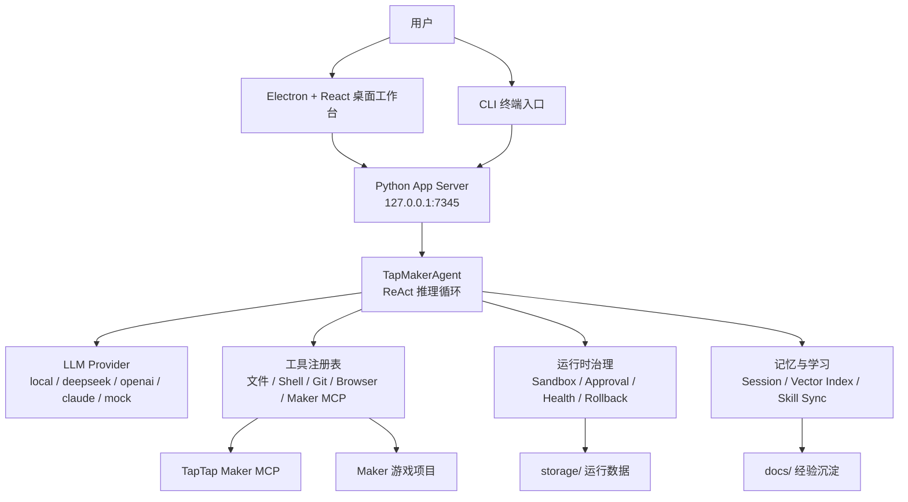

# TTMEvolve

TTMEvolve 是一个面向 TapTap Maker 游戏开发的自进化 Agent 工作台。

它的目标不是只做一个聊天框，而是把「理解项目、调用 Maker MCP、修改代码、构建验证、沉淀经验、下次复用」串成一个可持续迭代的本地开发系统。你可以把它理解为一个专门服务 TapTap Maker 的桌面级 AI IDE：前端是 Electron + React，后端是 Python App Server，Agent 通过工具系统、沙箱、审批、记忆和学习模块完成真实开发任务。

## 项目亮点

- **面向 TapTap Maker**：内置 Maker MCP 接入、项目选择、初始化、诊断和练习流程。
- **桌面工作台**：提供 Electron 桌面 GUI，包含聊天、文件树、预览、工具反馈和运行状态。
- **本地 App Server**：CLI、GUI、未来 TUI 都复用同一个 HTTP + SSE 协议。
- **多模型支持**：支持本地模型、DeepSeek、OpenAI 兼容接口、Claude、Mock 测试模式。
- **可控执行**：通过 sandbox、approval profile 和工具校验控制 Agent 行为边界。
- **自进化机制**：运行时记录任务轨迹、错误模式、修复经验和技能沉淀。
- **便携运行环境**：优先使用 `portable/`、`vendor/`、`.venv/` 等本地目录隔离缓存和运行依赖。

## 一句话启动

Windows 推荐直接双击或运行：

```powershell
.\start-gui.bat
```

如果你要做 TapTap Maker 实战项目，推荐使用：

```powershell
.\start-practice.bat
```

如果你只想在终端里跑 Agent：

```powershell
.\start.bat
```

## 系统架构



## 目录结构

| 路径 | 作用 |
| --- | --- |
| `agent/` | Agent 主循环、工具调用、MCP 集成、工具校验 |
| `core/` | 配置、沙箱、健康监控、运行时事件、可移植环境 |
| `server/` | 本地 App Server、SSE 会话、Maker 设置、浏览器服务 |
| `frontend/` | React 前端工作台 |
| `electron/` | Electron 主进程、preload、桌面壳构建 |
| `llm/` | LLM Provider 适配层 |
| `memory/` | 记忆管理 |
| `ecosystem/` | 技能同步、跨生态集成 |
| `scripts/` | 启动、依赖准备、构建、诊断脚本 |
| `tests/` | 自动化测试 |
| `docs/` | 架构、设计、反馈、发布和会话文档 |
| `workspace/` | 默认 Maker 练习项目目录，已忽略 |
| `storage/` | 运行数据和会话状态，已忽略 |
| `portable/` | 便携运行时 HOME、缓存、临时目录，已忽略 |
| `vendor/` | 可选内嵌 Python、Node、Git、模型、浏览器等，已忽略 |
| `models/` | 本地模型文件，已忽略 |

## 运行环境

### 必需环境

- Windows 10/11
- Python 3.10 或更高版本
- Node.js 18 或更高版本
- Git
- 可访问 npm 包源

### 可选环境

- TapTap Maker 账号与 Maker MCP 授权
- 本地 GGUF 模型文件
- DeepSeek / OpenAI 兼容 / Claude 等 API Key
- 内嵌运行时：`vendor/python`、`vendor/node`、`vendor/git`

启动脚本会优先使用 `vendor/` 下的内嵌运行时；如果没有，则使用系统 PATH 中的 Python、Node 和 Git。

## 快速开始

### 1. 克隆仓库

```powershell
git clone https://github.com/KingSystemHaiGo/TTMEvolve.git
cd TTMEvolve
```

### 2. 安装前端依赖

根目录、前端和 Electron 都有自己的 Node 依赖：

```powershell
npm install
cd frontend
npm install
cd ..\electron
npm install
cd ..
```

如果你只使用一键脚本，并且项目里已经有可用的 `node_modules/` 或内嵌依赖，可以先直接运行启动脚本。

### 3. 准备 Python 环境

首次运行 `start.ps1` 或 `start-gui.ps1` 时会自动创建 `.venv/`：

```powershell
.\start.bat
```

脚本会执行：

- 检测 Python
- 创建 `.venv/`
- 调用 `scripts/bootstrap.py`
- 检查或安装运行依赖
- 自动创建 `config.json`，如果它还不存在

### 4. 配置 `config.json`

首次启动时，如果根目录没有 `config.json`，脚本会从 `config.example.json` 复制一份：

```powershell
copy config.example.json config.json
```

`config.json` 是你的本地私有配置，已经被 `.gitignore` 排除，不应该提交到 GitHub。

最小可运行配置示例：

```json
{
  "llm": {
    "provider": "mock"
  },
  "project_root": "./workspace/default-maker-project",
  "storage_root": "./storage",
  "sandbox": {
    "mode": "workspace-write"
  },
  "approval": {
    "policy": "on-request"
  }
}
```

如果要使用 DeepSeek：

```json
{
  "llm": {
    "provider": "deepseek",
    "model": "deepseek-v4-pro",
    "api_key": "sk-...",
    "base_url": "https://api.deepseek.com"
  }
}
```

## 启动方式

### 桌面 GUI

```powershell
.\start-gui.bat
```

等价 PowerShell 入口：

```powershell
.\start-gui.ps1
```

GUI 启动流程：

1. 检测 Python、Node、Git。
2. 初始化 `portable/` 隔离运行时目录。
3. 创建或复用 `.venv/`。
4. 执行 `scripts/bootstrap.py`。
5. 构建 `frontend/` 到 Electron renderer。
6. 构建 Electron main/preload。
7. 打开桌面窗口。

如果 Electron 桌面壳启动失败，脚本会切换到浏览器调试模式：

```text
http://127.0.0.1:5173/
```

### Maker 实战练习模式

```powershell
.\start-practice.bat
```

等价 PowerShell 入口：

```powershell
.\start-practice.ps1
```

默认行为：

- 在 `workspace/smoke-maker-game` 创建 Maker 项目目录。
- 更新 `config.json` 的 `project_root` 和 `maker_mcp.cwd`。
- 调用 `npx -y @taptap/maker install --ide codex,cursor,claude`。
- 在 Maker 项目目录执行 `npx -y @taptap/maker init`。
- 启动 TTMEvolve GUI。

常用参数：

```powershell
.\start-practice.ps1 -ProjectName my-maker-game
.\start-practice.ps1 -ProjectDir D:\Games\my-maker-game
.\start-practice.ps1 -NoGui
.\start-practice.ps1 -SkipMakerInstall
.\start-practice.ps1 -SkipMakerInit
.\start-practice.ps1 -DryRun
```

### CLI 模式

```powershell
.\start.bat
```

直接执行一次任务：

```powershell
python main.py --provider mock "列出项目文件"
python main.py --provider deepseek "检查 Maker 项目状态"
python main.py --profile safe --provider mock "读取 README"
```

启动 App Server：

```powershell
python main.py --serve
```

打开旧版 GUI 入口：

```powershell
python main.py --gui
```

## App Server 协议

TTMEvolve 的 CLI 和 GUI 都通过本地 App Server 通信：

```text
http://127.0.0.1:7345
```

常用接口：

| 方法 | 路径 | 说明 |
| --- | --- | --- |
| `GET` | `/health` | 健康检查 |
| `POST` | `/sessions` | 创建任务会话 |
| `GET` | `/sessions/{id}/events` | SSE 任务事件流 |
| `GET` | `/sessions/{id}/status` | 查询任务状态 |
| `POST` | `/sessions/{id}/cancel` | 取消任务 |
| `POST` | `/config/llm` | 更新 LLM 配置 |
| `POST` | `/llm/probe` | 测试 LLM Provider |
| `GET` | `/tools` | 查看可用工具 |
| `POST` | `/maker/project/select` | 选择 Maker 项目 |
| `POST` | `/maker/practice/start` | 启动 Maker 实战初始化 |
| `GET` | `/maker/setup-status` | Maker 配置状态 |
| `GET` | `/maker/tool-audit` | Maker 工具诊断 |
| `GET` | `/runtime/readiness` | 运行时就绪状态 |
| `GET` | `/runtime/portable` | 便携环境诊断 |

创建任务示例：

```powershell
$body = @{ task = "读取 README 并总结项目能力"; provider = "mock" } | ConvertTo-Json
Invoke-RestMethod -Method Post -Uri http://127.0.0.1:7345/sessions -Body $body -ContentType "application/json"
```

## 配置说明

### LLM 配置

`llm.provider` 决定当前模型来源：

| provider | 说明 |
| --- | --- |
| `mock` | 测试模式，不调用真实模型 |
| `local` | 本地 GGUF 模型 |
| `deepseek` | DeepSeek API |
| `openai` | OpenAI 或兼容接口 |
| `claude` | Anthropic Claude API |

常用字段：

```json
{
  "llm": {
    "provider": "deepseek",
    "model": "deepseek-v4-pro",
    "api_key": "sk-...",
    "base_url": "https://api.deepseek.com",
    "timeout": 45,
    "max_history_steps": 6,
    "reserve_tokens": 256
  }
}
```

### Maker MCP 配置

```json
{
  "maker_mcp": {
    "command": "cmd.exe",
    "args": [
      "/d",
      "/s",
      "/c",
      "npx.cmd",
      "-y",
      "-p",
      "@taptap/maker",
      "taptap-maker"
    ],
    "cwd": "./workspace/default-maker-project",
    "env": {
      "TAPTAP_MCP_ENV": "production"
    },
    "request_timeout_seconds": 30
  },
  "project_root": "./workspace/default-maker-project"
}
```

注意：

- `maker_mcp.cwd` 应该指向真实 Maker 游戏项目，而不是 TTMEvolve 仓库根目录。
- Windows 路径建议写成 `D:/Games/my-maker-game`，不要在 JSON/TOML 字符串里裸写反斜杠。
- `start-practice.ps1` 会自动帮你更新 `project_root` 和 `maker_mcp.cwd`。

### 沙箱与审批

```json
{
  "sandbox": {
    "mode": "workspace-write"
  },
  "approval": {
    "policy": "on-request"
  },
  "profiles": {
    "safe": {
      "sandbox": { "mode": "read-only" },
      "approval": { "policy": "always" }
    },
    "autonomous": {
      "sandbox": { "mode": "workspace-write" },
      "approval": { "policy": "never" }
    }
  }
}
```

可选 sandbox：

- `read-only`：只读，适合检查和审计。
- `workspace-write`：允许写工作区，默认推荐。
- `danger-full-access`：高权限模式，只在你明确知道风险时使用。

可选 approval：

- `always`：所有敏感动作都需要确认。
- `on-request`：按工具和风险请求确认。
- `never`：不请求确认，适合自动化环境。

## 开发命令

### 前端开发

```powershell
npm run dev:frontend
```

默认 Vite 地址：

```text
http://127.0.0.1:5173/
```

### Electron 开发

```powershell
npm run dev:electron
```

### 同时运行前端和 Electron

```powershell
npm run dev
```

### 构建

```powershell
npm run build
```

构建前端：

```powershell
npm run build:frontend
```

构建 Electron：

```powershell
npm run build:electron
```

打包桌面分发：

```powershell
npm run dist
```

## 测试

推荐先跑 Python 单元测试：

```powershell
python -m pytest
```

也可以单独跑关键测试：

```powershell
python -m pytest tests/test_app_server.py
python -m pytest tests/test_session_store.py
python -m pytest tests/test_maker_setup.py
python -m pytest tests/test_runtime_events.py
python -m pytest tests/test_tool_call_validation.py
```

如果只是验证 CLI 和 App Server：

```powershell
python main.py --provider mock "status"
python main.py --serve
```

## 典型工作流

### 新建一个 Maker 练习项目

```powershell
.\start-practice.ps1 -ProjectName smoke-maker-game
```

完成后，在 GUI 里输入一个小任务，例如：

```text
给主界面添加一个开始按钮，并构建验证
```

### 切换到已有 Maker 项目

```powershell
.\start-practice.ps1 -ProjectDir D:\TapTapMakerProjects\my-game -SkipMakerInit
```

或者在 GUI 内通过 Maker 项目选择能力切换。

### 检查 LLM 是否真的可用

启动服务后调用：

```powershell
$body = @{ provider = "deepseek"; timeout = 20 } | ConvertTo-Json
Invoke-RestMethod -Method Post -Uri http://127.0.0.1:7345/llm/probe -Body $body -ContentType "application/json"
```

### 查看 Maker 接入状态

```powershell
Invoke-RestMethod http://127.0.0.1:7345/maker/setup-status
Invoke-RestMethod http://127.0.0.1:7345/maker/tool-audit
```

## 数据与安全边界

以下内容不会提交到 Git：

- `config.json`
- `.env`
- `.env.*`
- `.venv/`
- `node_modules/`
- `storage/`
- `portable/`
- `workspace/`
- `test_project/`
- `vendor/`
- `models/`
- `logs/`
- `.codex/`
- `.cursor/`
- `.mcp.json`
- Windows 快捷方式和本地启动脚本包装文件

请不要提交：

- API Key
- TapTap Maker 登录态
- 本地模型文件
- 用户缓存
- 构建产物
- 真实项目中的隐私素材

## 常见问题

### 1. 第一次启动提示 `config.json missing`

这是正常行为。脚本已经从 `config.example.json` 创建了 `config.json`，请按需填写 LLM、Maker 项目路径和 API Key，然后重新启动。

### 2. Electron 窗口闪退

查看日志：

```text
logs/gui/
start-gui.log
```

如果 Electron 启动失败，`start-gui.ps1` 会尝试切换到浏览器调试模式：

```text
http://127.0.0.1:5173/
```

### 3. Maker MCP 无法连接

先运行：

```powershell
.\start-practice.ps1 -NoGui
```

然后检查：

```text
http://127.0.0.1:7345/maker/setup-status
http://127.0.0.1:7345/maker/tool-audit
```

常见原因：

- 没有安装 Node.js 或找不到 `npx`。
- Maker 项目还没有初始化。
- TapTap Maker 授权未完成。
- `maker_mcp.cwd` 指向了错误目录。

### 4. TOML 或 JSON 路径解析报错

Windows 路径建议统一写成正斜杠：

```text
D:/CC/TTMEvolve
```

不要在 TOML 双引号字符串里写：

```text
D:\CC\TTMEvolve
```

因为 `\C` 可能被解析成非法转义。

### 5. Python 依赖安装失败

可以删除损坏的虚拟环境后重试：

```powershell
Remove-Item -Recurse -Force .venv
.\start.bat
```

如果你使用内嵌 Python，请确认：

```text
vendor/python/python.exe
```

存在且可执行。

### 6. 前端依赖缺失

分别安装根目录、前端和 Electron 的依赖：

```powershell
npm install
cd frontend
npm install
cd ..\electron
npm install
cd ..
```

### 7. 想先离线测试，不调用真实模型

使用 mock provider：

```powershell
python main.py --provider mock "列出项目文件"
```

## GitHub 协作

当前仓库远程地址：

```text
https://github.com/KingSystemHaiGo/TTMEvolve
```

常规提交：

```powershell
git status
git add .
git commit -m "描述本次修改"
git push
```

首次推送 main 分支：

```powershell
git push -u origin main
```

查看远程：

```powershell
git remote -v
```

## 路线图

- [x] 三层架构：Agent Layer、Runtime Layer、Learning Layer
- [x] 本地 App Server 和 SSE 会话协议
- [x] Electron + React 桌面工作台
- [x] Maker MCP 安装、初始化、诊断和实战入口
- [x] 多 LLM Provider 接入
- [x] 沙箱、审批、健康监控和运行时事件
- [x] 记忆、技能同步和经验沉淀基础设施
- [ ] 更稳定的 Maker 项目端到端构建验证
- [ ] 更完整的模型配置向导
- [ ] 更细粒度的任务回放和可视化调试
- [ ] 更强的自动修复与回滚策略

## 许可证

当前仓库暂未声明开源许可证。发布或公开协作前，请先补充 `LICENSE` 文件并明确使用范围。
