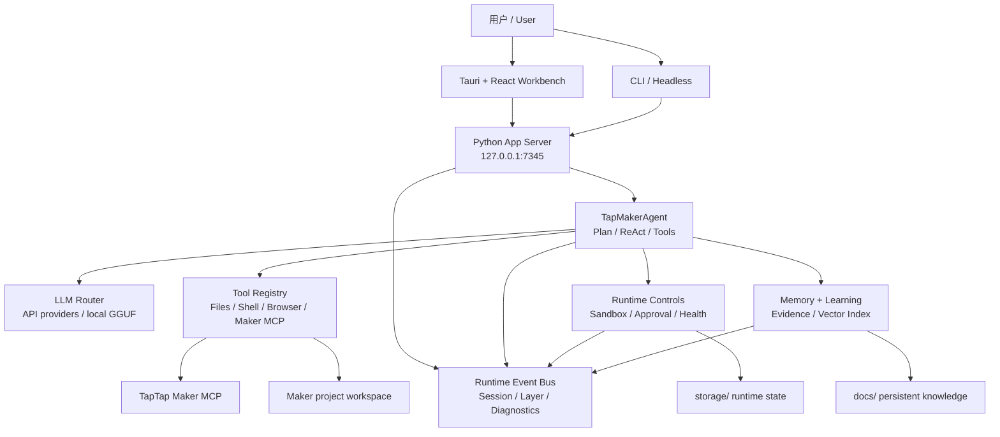

# TTMEvolve

中文优先 / Chinese first: TTMEvolve 是面向 TapTap Maker 游戏开发的桌面 AI Agent 工作台。它把 Tauri + React 桌面壳、本地 Python App Server、Maker MCP 诊断、API 优先的 LLM 路由、运行时证据、记忆与学习流程整合到一个本地开发驾驶舱里。

English: TTMEvolve is a desktop AI Agent workbench for TapTap Maker game development. It combines a Tauri + React desktop shell, a local Python App Server, Maker MCP diagnostics, API-first LLM routing, runtime evidence, memory, and learning workflows into one local development cockpit.

- 中文 README: [README.zh-CN.md](README.zh-CN.md)
- English readers: every public GitHub document is maintained bilingually, with Chinese first.

## 当前发布状态 / Current Release State

| 项目 / Item | 状态 / Status |
| --- | --- |
| 源码 checkpoint / Source checkpoint | Ready |
| 版本线 / Version line | `0.4.5-one-click-practice-entry+gui-chat-readable` |
| 主桌面壳 / Primary desktop shell | Tauri 2.x + Rust + WebView2 |
| 前端 / Frontend | React + Vite workbench |
| 后端 / Backend | Python App Server on `http://127.0.0.1:7345` |
| LLM 运行时 / LLM runtime | API providers first; local GGUF is an explicit fallback |
| Maker 集成 / Maker integration | Maker setup, readiness, tool audit, and MCP reconnect flows |
| 完整离线发布 / Full offline release | Partial / not claimed |

当前 GitHub 状态是稳定源码发布 checkpoint。它不声明签名安装包、Maker 远程构建 smoke、生产 RAG 语义质量证明，也不把本机 `portable/` 缓存状态作为公开发布承诺。

The current GitHub state is a stable source release checkpoint. It does not claim a signed installer, Maker remote build smoke, production RAG semantic-quality proof, or a public guarantee for the current local `portable/` cache state.

## 快速开始 / Quick Start

Windows 桌面 GUI / Windows desktop GUI:

```powershell
.\start-tauri.bat
```

CLI 与无界面模式 / CLI and headless modes:

```powershell
.\start-tauri.bat --cli
.\start-tauri.bat --headless
```

后端 smoke check / Backend-only smoke check:

```powershell
python main.py --serve --mock
```

启动器会优先使用 `portable/` 下的嵌入式运行时，然后是 `.venv/`，最后才是系统工具。源码 checkout 中如果没有 Tauri 二进制产物，启动器会构建前端并通过 Cargo 启动 Tauri。

The launcher prefers embedded runtimes under `portable/`, then `.venv/`, then system tools. In a source checkout, if no Tauri binary exists, the launcher builds the frontend and starts Tauri with Cargo.

## 能力概览 / What TTMEvolve Provides

- 面向 TapTap Maker 开发的 chat-first 桌面 Agent 界面。
- A chat-first desktop Agent surface for TapTap Maker game work.
- 通过 Tauri/WebView2 桌面壳提供原生 Maker 预览。
- Native Maker preview through the Tauri/WebView2 shell.
- Maker MCP 设置诊断、readiness 检查、tool audit 与 reconnect 支持。
- Maker MCP setup diagnostics, readiness checks, tool audit, and reconnect support.
- MiniMax、OpenAI-compatible、Claude-style provider 和本地 fallback 的选择与 probe 证据。
- API provider selection and probe evidence for MiniMax, OpenAI-compatible providers, Claude-style providers, and local fallback paths.
- Runtime Readiness、Evidence Bundle、LLM Onboarding 和外部 Agent handoff 端点。
- Runtime Readiness, Evidence Bundle, LLM Onboarding, and handoff endpoints for debugging and external Agent collaboration.
- Plan-first Agent 执行，包含 sandbox、approval、tool validation、runtime events 与持久会话回放。
- Plan-first Agent execution with sandbox, approval, tool validation, runtime events, and durable session replay.

## 公开文档 / Public Documentation

这些文档都是 GitHub 公开面向的中英双语文档，中文优先。

These are public GitHub-facing bilingual documents, with Chinese first.

- [文档索引 / Documentation index](docs/README.md)
- [开发指南 / Development guide](docs/DEVELOPMENT.md)
- [App Server API](docs/API.md)
- [路线图 / Roadmap](docs/ROADMAP.md)
- [架构说明 / Architecture notes](docs/architecture/README.md)
- [发布说明 / Release notes](docs/releases/README.md)
- [更新记录 / Changelog](CHANGELOG.md)
- [贡献指南 / Contributing](CONTRIBUTING.md)
- [安全政策 / Security policy](SECURITY.md)
- [支持方式 / Support](SUPPORT.md)

## 架构 / Architecture



## 目录结构 / Repository Map

| 路径 / Path | 用途 / Purpose |
| --- | --- |
| `src-tauri/` | Tauri/Rust 桌面壳、后端生命周期、原生命令、更新器和打包配置。 / Primary Tauri/Rust desktop shell, backend lifecycle, native commands, updater, and bundle config. |
| `frontend/` | React + Vite workbench UI。 / React + Vite workbench UI. |
| `server/` | 本地 App Server、会话 API、证据/readiness API、Maker 设置 API 和 browser service。 / Local App Server, session APIs, evidence/readiness APIs, Maker setup APIs, and browser service. |
| `agent/` | Agent runtime、Plan First、ReAct loop、工具执行、Maker guard、MCP 集成和轨迹辅助模块。 / Agent runtime, Plan First, ReAct loop, tool execution, Maker guard, MCP integration, and trajectory helpers. |
| `core/` | 配置、sandbox、approval、health、runtime events、contracts 与 portable 环境检查。 / Config, sandbox, approval, health, runtime events, contracts, and portable environment checks. |
| `llm/` | LLM providers、router/factory、本地 GGUF 支持和 provider presets。 / LLM providers, router/factory, local GGUF support, and provider presets. |
| `memory/` | 记忆管理、AGENTS.md 索引、向量/冷记忆、RAG benchmark 和 RAG quality evaluation。 / Memory manager, AGENTS.md indexing, vector/cold memory, RAG benchmark, and RAG quality evaluation. |
| `learning/` | 轨迹收集、反思、shared-memory bridge、skill generation 和 validation。 / Trajectory collection, reflection, shared-memory bridge, skill generation, and validation. |
| `ecosystem/` | 跨 Agent adapter 和 skill sync。 / Cross-agent adapters and skill sync. |
| `electron/` | 旧 Electron 兼容构建面。 / Legacy Electron compatibility build surface. |
| `tests/` | Python regression and integration tests。 / Python regression and integration tests. |
| `docs/` | 公开文档、release notes、architecture records 和项目知识。 / Public docs, release notes, architecture records, and project knowledge. |

忽略的本地/运行时状态包括 `storage/`、`portable/`、`workspace/`、`vendor/`、`models/`、`node_modules/`、`src-tauri/target/`、`logs/`、`.env*`、`.mcp.json` 和 `release-artifacts/`。

Ignored local/runtime state includes `storage/`, `portable/`, `workspace/`, `vendor/`, `models/`, `node_modules/`, `src-tauri/target/`, `logs/`, `.env*`, `.mcp.json`, and `release-artifacts/`.

## 开发命令 / Development Commands

前端构建 / Frontend build:

```powershell
npm.cmd --prefix frontend run build
```

Electron 兼容构建 / Electron compatibility build:

```powershell
npm.cmd --prefix electron run build
```

Tauri/Rust 测试 / Tauri/Rust tests:

```powershell
cargo test --manifest-path src-tauri\Cargo.toml
```

Python 测试 / Python tests:

```powershell
.venv\Scripts\python.exe -m pytest -q
```

发布 readiness / Release readiness:

```powershell
.venv\Scripts\python.exe scripts\release_readiness.py --mode source-checkpoint --json
.venv\Scripts\python.exe scripts\release_readiness.py --mode full-offline --json
```

源码 checkpoint 打包 / Source checkpoint package:

```powershell
.venv\Scripts\python.exe scripts\package_release.py
```

## 最新验证 / Latest Verification

最近一次公开 checkpoint 验证记录如下。`full-offline` 的 `partial` 是刻意保守的发布边界，不是源码 checkpoint 失败。

The latest public checkpoint was verified with the commands below. The `full-offline` `partial` result is an intentionally conservative release boundary, not a source checkpoint failure.

- `.venv\Scripts\python.exe -m pytest -q` -> `748 passed, 14 skipped`
- `npm.cmd --prefix frontend run build` -> passed
- `npm.cmd --prefix electron run build` -> passed with Vite CJS deprecation warnings only
- `cargo test --manifest-path src-tauri\Cargo.toml` -> `34 passed`, warnings only
- `.venv\Scripts\python.exe -m pytest tests\test_package_release.py tests\test_release_readiness.py -q` -> `8 passed`
- `.venv\Scripts\python.exe scripts\release_readiness.py --mode source-checkpoint --json` -> `status=ready`
- `.venv\Scripts\python.exe scripts\release_readiness.py --mode full-offline --json` -> `status=partial`
- `git diff --check` -> passed with existing LF/CRLF warnings only

源码包证据会写入生成的 manifest。该目录本地生成，并故意被 Git 忽略。

Source package evidence is written to the generated manifest. The directory is generated locally and intentionally ignored by Git.

```text
release-artifacts/TTMEvolve-source-v0.4.5-one-click-practice-entry.zip
release-artifacts/TTMEvolve-source-v0.4.5-one-click-practice-entry.zip.manifest.json
```

## 发布边界 / Release Boundaries

可以声明 / Ready to claim:

- 稳定源码 checkpoint。 / Stable source checkpoint.
- 可见启动入口存在。 / Visible launch surface exists.
- 源码包审计通过。 / Source package audit passes.

暂不声明 / Not yet claimed:

- 签名安装包。 / Signed installer artifacts.
- Maker 远程构建 side-effect smoke。 / Maker remote build side-effect smoke.
- 使用真实 golden corpus 与生产 embedding artifact 的 RAG 语义质量证明。 / Production RAG semantic-quality proof with a real golden corpus and production embedding artifact.
- 本机 `portable/` 缓存状态的公开可复现保证。 / Public reproducibility guarantee for the current local `portable/` cache state.

## App Server API

默认本地服务 / Default local server:

```text
http://127.0.0.1:7345
```

常用端点 / Useful endpoints:

| Method | Path | 用途 / Purpose |
| --- | --- | --- |
| `GET` | `/health` | 健康与运行时状态 / Health and runtime status |
| `POST` | `/sessions` | 创建 Agent 会话 / Create an Agent session |
| `GET` | `/sessions/{id}/events` | SSE 事件流 / SSE event stream |
| `POST` | `/sessions/{id}/cancel` | 取消会话 / Cancel a session |
| `POST` | `/config/llm` | 更新 LLM 配置 / Update LLM configuration |
| `POST` | `/llm/probe` | Probe configured LLM provider |
| `GET` | `/runtime/readiness` | 无网络 runtime readiness gate / No-network runtime readiness gate |
| `GET` | `/runtime/portable` | portable 环境诊断 / Portable environment diagnostics |
| `GET` | `/maker/setup-status` | Maker 设置状态 / Maker setup status |
| `GET` | `/maker/tool-audit` | Maker 远程/本地工具审计 / Maker remote/local tool audit |
| `GET` | `/sessions/{id}/evidence?steps=20` | 紧凑 runtime evidence bundle / Compact runtime evidence bundle |
| `GET` | `/agent/onboarding?session_id=...&steps=20` | 外部 Agent onboarding bundle / External Agent onboarding bundle |

## 安全边界 / Safety Notes

不要提交 API keys、TapTap Maker auth state、本地模型文件、用户缓存、构建输出或私有项目素材。

Do not commit API keys, TapTap Maker auth state, local model files, user caches, build outputs, or private project assets.

重要忽略/私有路径 / Important ignored/private paths:

- `config.json`
- `.env*`
- `.mcp.json`
- `.venv/`
- `node_modules/`
- `storage/`
- `portable/`
- `workspace/`
- `vendor/`
- `models/`
- `logs/`
- `release-artifacts/`

## 许可证 / License

本项目使用 [MIT License](LICENSE)。

This project is released under the [MIT License](LICENSE).
