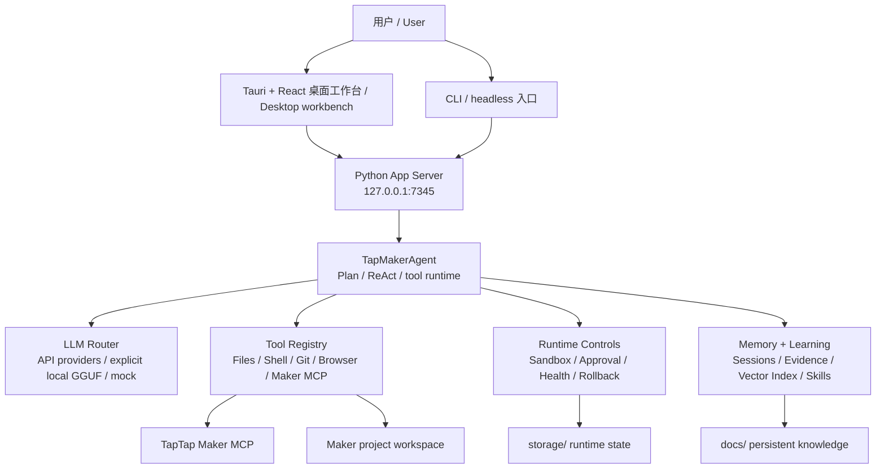

# TTMEvolve

> **v1.5.1 全量验证通过 / Full Validation Pass**  
> Tauri 2.x + Rust + WebView2 桌面壳、React 工作台、Python App Server、云端/API LLM 路由、Maker MCP 集成，并完成跨栈验证。  
> Tauri 2.x + Rust + WebView2 desktop shell, React workbench, Python App Server, cloud/API LLM routing, Maker MCP integration, and cross-stack validation.

TTMEvolve 是一个面向 TapTap Maker 游戏开发的桌面 AI Agent 工作台。它把项目理解、Maker MCP 工具调用、代码修改、构建验证、运行时证据、记忆沉淀和学习反馈连接成一个本地开发系统。

TTMEvolve is a desktop AI Agent workbench for TapTap Maker game development. It connects project understanding, Maker MCP tools, code edits, build verification, runtime evidence, memory, and learning into one local development system.

当前主 GUI 是 **Tauri + React**。Python 后端提供 App Server、会话运行时、Maker 设置 API、LLM 路由、沙箱/审批控制、记忆和学习服务。`electron/` 目前保留为旧版兼容构建面，不是正常用户入口。

The current primary GUI is **Tauri + React**. The Python backend provides the App Server, session runtime, Maker setup APIs, LLM routing, sandbox/approval controls, memory, and learning services. `electron/` is kept as a legacy compatibility build surface, not the normal user entry.

## 当前状态 / Current Status

- **最新验证基线 / Validation baseline**: `a3e7626 v1.5.1: full validation bugfix pass`
- **Python 测试 / Python tests**: `598 passed, 14 skipped`
- **Rust/Tauri 测试 / Rust/Tauri tests**: `32 passed`
- **前端构建 / Frontend build**: passed
- **Electron 兼容构建 / Electron compatibility build**: passed
- **测试范围 / Test scope**: `pytest.ini` 限定只收集 `tests/`，并跳过 `portable/`、`storage/`、`workspace/`、`vendor/` 等运行时状态目录
- **Test collection**: `pytest.ini` limits collection to `tests/` and skips runtime state directories such as `portable/`, `storage/`, `workspace/`, and `vendor/`

## 核心能力 / Highlights

- **Tauri 桌面壳 / Tauri desktop shell**: Rust + WebView2，统一管理 Python 后端和 fast_ops bridge 生命周期。Rust + WebView2 with lifecycle management for the Python backend and fast_ops bridge.
- **React 工作台 / React workbench**: 聊天优先的 Agent UI、Maker 预览、设置/工具面板、运行时证据和诊断。Chat-first Agent UI, Maker preview, setup/tool panels, runtime evidence, and diagnostics.
- **Python App Server**: 本地 HTTP/SSE 运行时，覆盖会话、文件、浏览器工具、Maker 设置、LLM 探针和证据包。Local HTTP/SSE runtime for sessions, files, browser tooling, Maker setup, LLM probes, and evidence bundles.
- **API-first LLM runtime**: 支持 OpenAI-compatible、Claude、DeepSeek、Qwen、Zhipu、Moonshot、SiliconFlow、MiniMax，并保留显式 local GGUF fallback。Supports OpenAI-compatible APIs, Claude, DeepSeek, Qwen, Zhipu, Moonshot, SiliconFlow, MiniMax, and explicit local GGUF fallback.
- **Maker MCP 集成 / Maker MCP integration**: 项目选择、Setup Doctor、工具审计、授权/Home 隔离和远程 Maker 工具注册。Project selection, setup doctor, tool audit, auth/home isolation, and remote Maker tool registration.
- **可控执行 / Controlled execution**: sandbox、approval profile、工具校验、结构化运行时事件、回滚/version helper 和紧凑诊断。Sandbox modes, approval profiles, tool validation, structured runtime events, rollback/version helpers, and compact diagnostics.
- **记忆与学习 / Memory and learning**: 会话证据、向量/冷记忆、技能同步、异步反思和持久化经验。Session evidence, vector/cold memory, skill sync, async reflection, and persistent runtime lessons.

## 快速开始 / Quick Start

Windows 推荐使用可见快捷方式，或运行：

On Windows, use the visible launcher or run:

```powershell
.\start-tauri.bat
```

CLI / headless 模式使用同一个启动器：

CLI/headless modes use the same launcher:

```powershell
.\start-tauri.bat --cli
.\start-tauri.bat --headless
```

只做后端 smoke check：

For a backend-only smoke run:

```powershell
python main.py --serve --mock
```

启动器会优先使用 `portable/` 内嵌运行时，然后尝试 `.venv/`，最后使用系统工具。正常用户路径应保持 GUI-first；bat/PowerShell 脚本只是 bootstrap 细节。

The launcher prefers embedded runtimes under `portable/`, then `.venv/`, then system tools. Normal user-facing launch should stay GUI-first; batch and PowerShell scripts are bootstrap details.

## 架构 / Architecture



## 目录结构 / Repository Map

| 路径 / Path | 用途 / Purpose |
| --- | --- |
| `src-tauri/` | 主 Tauri/Rust 桌面壳、生命周期、fast_ops bridge、commands、updater、bundle config / Primary Tauri/Rust shell, lifecycle, bridge, commands, updater, bundle config |
| `frontend/` | React + Vite 工作台 UI / React + Vite workbench UI |
| `server/` | 本地 App Server、会话 API、Maker 设置/状态 API、浏览器服务 / Local App Server, session APIs, Maker setup/status APIs, browser service |
| `agent/` | Agent 运行时、ReAct loop、工具注册、MCP 集成、工具校验 / Agent runtime, ReAct loop, tool registry, MCP integration, tool validation |
| `core/` | 配置、沙箱、审批、健康、运行时事件、portable 环境、updater client / Config, sandbox, approval, health, runtime events, portable environment, updater client |
| `llm/` | LLM providers、router/factory、本地 GGUF、provider presets / LLM providers, router/factory, local GGUF support, provider presets |
| `memory/` | 记忆管理、AGENTS.md 解析/索引、向量/冷记忆 / Memory manager, AGENTS.md parsing/indexing, vector/cold memory |
| `learning/` | 轨迹收集、反思、技能生成/验证 / Trajectory collection, reflection, skill generation/validation |
| `ecosystem/` | 跨 Agent adapter 与 skill sync / Cross-agent adapters and skill sync |
| `electron/` | 旧版 Electron 兼容构建面 / Legacy Electron compatibility build surface |
| `scripts/` | bootstrap、打包、诊断、portable runtime helpers / Bootstrap, packaging, diagnostics, portable runtime helpers |
| `tests/` | Python 回归测试 / Python regression tests |
| `docs/` | 发布、架构、记忆、路线图、会话知识 / Release notes, architecture notes, memory, roadmaps, session knowledge |
| `workspace/` | 被忽略的默认 Maker 工作区 / Ignored default Maker workspace |
| `portable/` | 被忽略的 portable runtime home/cache/temp/auth state / Ignored portable runtime state |
| `storage/` | 被忽略的运行时/会话状态 / Ignored runtime/session state |
| `vendor/` | 被忽略的可选内嵌依赖 / Ignored optional embedded dependencies |
| `models/` | 被忽略的本地 GGUF/model 文件 / Ignored local GGUF/model files |

## 环境要求 / Requirements

源码开发需要：

For development from source:

- Windows 10/11（主 GUI 使用 WebView2）/ Windows 10/11 for the primary WebView2 GUI path
- Python 3.10+
- Node.js 18+
- Rust toolchain with Cargo
- Git
- 可访问 npm 包源 / npm package source access

Maker 开发需要：

For Maker work:

- TapTap Maker 账号和 Maker MCP 授权 / TapTap Maker account and Maker MCP authorization
- 一个真实 Maker 项目目录，通常在 `workspace/default-maker-project` 或用户选择的项目目录 / A real Maker project directory, usually under `workspace/default-maker-project` or another selected project directory

真实 LLM 执行需要：

For real LLM execution:

- 已配置的 API provider/key，或 / A configured API provider/key, or
- 显式 local GGUF setup / An explicit local GGUF setup

`mock` 只用于测试和离线 smoke check。正常 GUI 执行应使用真实 provider，或明确失败为 unconfigured。

`mock` is for tests and offline smoke checks. Normal GUI execution should use a real provider or fail clearly as unconfigured.

## 配置 / Configuration

首次启动时可从 `config.example.json` 复制 `config.json`。`config.json` 是本地私有配置，已被 Git 忽略。

On first startup, `config.example.json` can be copied to `config.json`. `config.json` is local/private and ignored by Git.

最小测试配置 / Minimal test configuration:

```json
{
  "llm": {
    "provider": "mock"
  },
  "project_root": "./workspace/default-maker-project",
  "storage_root": "./storage",
  "sandbox": {
    "mode": "workspace-write"
  },
  "approval": {
    "policy": "on-request"
  }
}
```

Maker MCP 配置应指向真实 Maker 游戏项目，而不是 TTMEvolve app root。

Maker MCP configuration should point at the actual Maker game project, not the TTMEvolve app root.

```json
{
  "maker_mcp": {
    "command": "cmd.exe",
    "args": [
      "/d",
      "/s",
      "/c",
      "npx.cmd",
      "-y",
      "-p",
      "@taptap/maker",
      "taptap-maker"
    ],
    "cwd": "./workspace/default-maker-project",
    "env": {
      "TAPTAP_MCP_ENV": "production",
      "TAPTAP_MAKER_HOME": "./portable/taptap-maker",
      "TTM_MAKER_HOME": "./portable/taptap-maker"
    },
    "request_timeout_seconds": 30
  },
  "project_root": "./workspace/default-maker-project"
}
```

Maker 关键规则 / Important Maker rules:

- `maker_mcp.cwd` 和相对配置路径都按 config 文件位置解析 / `maker_mcp.cwd` and relative config paths are config-file-relative.
- `TAPTAP_MAKER_HOME` 是官方 Maker auth/home 变量，`TTM_MAKER_HOME` 作为兼容镜像 / `TAPTAP_MAKER_HOME` is the official Maker auth/home variable; `TTM_MAKER_HOME` is mirrored for compatibility.
- 空值、`0`、`none`、`null`、`undefined` 的 Maker project id 都视为未绑定 / Empty, `0`, `none`, `null`, or `undefined` Maker project ids are treated as not bound.

## 开发命令 / Development Commands

前端构建 / Frontend build:

```powershell
npm.cmd --prefix frontend run build
```

Electron 兼容构建 / Legacy Electron compatibility build:

```powershell
npm.cmd --prefix electron run build
```

Tauri/Rust 测试 / Tauri/Rust tests:

```powershell
cargo test --manifest-path src-tauri/Cargo.toml
```

Tauri 开发壳，需要已安装 Tauri CLI / Tauri development shell, when the Tauri CLI is available:

```powershell
cd src-tauri
cargo tauri dev
```

Python 测试 / Python tests:

```powershell
.venv\Scripts\python.exe -m pytest -q
```

真实 local GGUF smoke test 需要显式开启，因为它慢且依赖机器环境。

Real local GGUF smoke tests are opt-in because they are slow and machine-dependent.

```powershell
$env:TTMEVOLVE_RUN_REAL_LOCAL_LLM = "1"
.venv\Scripts\python.exe -m pytest tests/test_local_llm.py -q
```

## App Server API

默认本地服务 / Default local server:

```text
http://127.0.0.1:7345
```

常用端点 / Common endpoints:

| Method | Path | 说明 / Purpose |
| --- | --- | --- |
| `GET` | `/health` | 健康与运行时状态 / Health and runtime status |
| `POST` | `/sessions` | 创建 Agent 会话 / Create an Agent session |
| `GET` | `/sessions/{id}/events` | SSE 事件流 / SSE event stream |
| `GET` | `/sessions/{id}/status` | 会话状态 / Session status |
| `POST` | `/sessions/{id}/cancel` | 取消会话 / Cancel session |
| `POST` | `/config/llm` | 更新 LLM 配置 / Update LLM configuration |
| `POST` | `/llm/probe` | 探测 LLM provider / Probe configured LLM provider |
| `GET` | `/tools` | 工具列表 / List available Agent tools |
| `POST` | `/maker/project/select` | 选择 Maker 项目 / Select Maker project |
| `POST` | `/maker/practice/start` | 启动 Maker practice/setup flow / Start Maker practice/setup flow |
| `GET` | `/maker/setup-status` | Maker 设置状态 / Maker setup status |
| `GET` | `/maker/tool-audit` | Maker 工具审计 / Maker remote/local tool audit |
| `GET` | `/runtime/readiness` | 无网络 readiness gate / No-network runtime readiness gate |
| `GET` | `/runtime/portable` | portable 环境诊断 / Portable environment diagnostics |
| `GET` | `/sessions/{id}/evidence?steps=20` | 紧凑运行时证据包 / Compact runtime evidence bundle |
| `GET` | `/sessions/{id}/evidence.md?steps=20` | 可粘贴证据 Markdown / Pasteable evidence Markdown |

## 数据与安全边界 / Data And Safety Boundaries

不要提交本地/私有运行时状态：

Do not commit local/private runtime state:

- `config.json`
- `.env*`
- `.venv/`
- `node_modules/`
- `storage/`
- `portable/`
- `workspace/`
- `vendor/`
- `models/`
- `logs/`
- `.codex/`
- `.cursor/`
- `.mcp.json`
- 生成的快捷方式和本地构建产物 / generated shortcuts and local build artifacts

不要提交 API keys、TapTap Maker 登录态、本地模型文件、用户缓存、构建产物或真实项目里的私有素材。

Never commit API keys, TapTap Maker auth state, local model files, user caches, build outputs, or private project assets.

## 排障 / Troubleshooting

只检查后端时：

If the backend must be checked without GUI:

```powershell
python main.py --serve --mock
```

如果已配置 provider，但需要证明它真的被调用，请使用 `/llm/probe` 并检查 endpoint/tokens/latency 证据。MiniMax 应出现 `/text/chatcompletion_v2`；OpenAI-compatible providers 应出现 `/chat/completions`；Claude 应出现 `/messages`。

If a provider is configured but you need proof it is actually called, use `/llm/probe` and inspect endpoint/tokens/latency evidence. MiniMax should show `/text/chatcompletion_v2`; OpenAI-compatible providers should show `/chat/completions`; Claude should show `/messages`.

Maker 工具缺失时 / If Maker tools are missing:

1. 检查 `GET /runtime/portable`，确认 home/cache/temp 没有泄漏 / Check `GET /runtime/portable` for home/cache/temp leaks.
2. 检查 `GET /maker/setup-status` / Check `GET /maker/setup-status`.
3. 检查 `GET /maker/tool-audit` / Check `GET /maker/tool-audit`.
4. 确认当前 Maker 项目有真实绑定 project id 和 `.project/settings.json` / Confirm the active Maker project has a real bound project id and `.project/settings.json`.
5. 确认同时设置 `TAPTAP_MAKER_HOME` 和 `TTM_MAKER_HOME` / Confirm both `TAPTAP_MAKER_HOME` and `TTM_MAKER_HOME` are set.

如果测试意外扫描运行时状态，请确认 `pytest.ini` 存在且 `testpaths = tests` 生效。

If tests unexpectedly scan runtime state, confirm `pytest.ini` is present and `testpaths = tests` is active.

## GitHub

仓库 / Repository:

```text
https://github.com/KingSystemHaiGo/TTMEvolve
```

广义同步前的 release gate / Current release gate for a broad sync:

```powershell
.venv\Scripts\python.exe -m pytest -q
npm.cmd --prefix frontend run build
npm.cmd --prefix electron run build
cargo test --manifest-path src-tauri/Cargo.toml
```

## 许可证 / License

Tauri bundle metadata 当前声明 MIT。公开分发前请确保 `LICENSE` 文件存在并与发布策略一致。

The Tauri bundle metadata currently declares MIT. Ensure `LICENSE` is present and aligned before public distribution.
