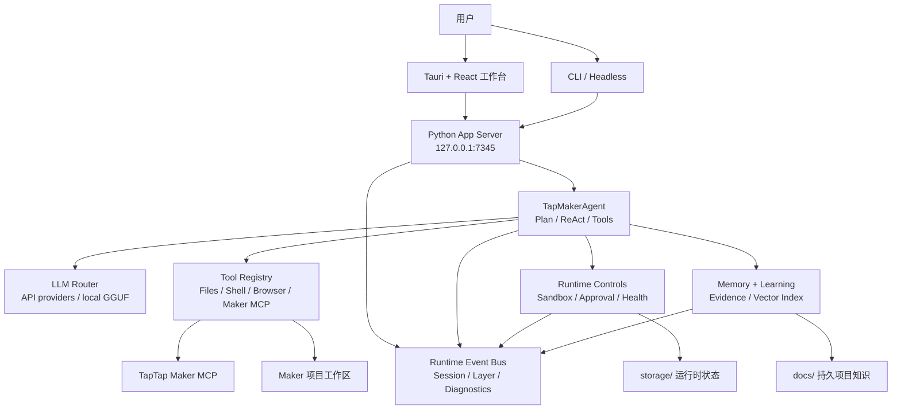

# TTMEvolve

[English README](README.md)

TTMEvolve 是一个面向 TapTap Maker 游戏开发的桌面 AI Agent 工作台。它把 Tauri + React 桌面外壳、本地 Python App Server、Maker MCP 诊断、API 优先的 LLM 路由、运行时证据、记忆与学习流程整合到一个本地开发驾驶舱里。

## 当前发布状态

| 项目 | 状态 |
| --- | --- |
| 源码 checkpoint | Ready |
| 版本线 | `0.4.5-one-click-practice-entry+gui-chat-readable` |
| 主桌面外壳 | Tauri 2.x + Rust + WebView2 |
| 前端 | React + Vite 工作台 |
| 后端 | Python App Server，默认 `http://127.0.0.1:7345` |
| LLM 运行时 | API Provider 优先；本地 GGUF 是显式 fallback |
| Maker 集成 | Maker 设置、就绪检查、工具审计、MCP 重连流程 |
| 离线 runtime bundle | 清理缓存后审计 ready，portable Node 仍是 warning |
| 完整可发布离线版 | Partial，尚不声明完成 |

当前 GitHub 状态可以声明为稳定源码发布 checkpoint。它还不声明签名安装包、Maker 远程构建 smoke、生产 RAG 语义质量证明。

## 快速开始

Windows 上启动桌面 GUI：

```powershell
.\start-tauri.bat
```

CLI 与无界面模式：

```powershell
.\start-tauri.bat --cli
.\start-tauri.bat --headless
```

仅后端 smoke：

```powershell
python main.py --serve --mock
```

启动器会优先使用 `portable/` 下的内嵌运行时，然后尝试 `.venv/`，最后使用系统工具。在源码 checkout 中，如果还没有 Tauri 二进制文件，启动器会先构建前端，再用 Cargo 启动 Tauri。

## TTMEvolve 提供什么

- 面向 TapTap Maker 工作流的 chat-first 桌面 Agent。
- 通过 Tauri/WebView2 外壳提供原生 Maker 预览。
- Maker MCP 设置诊断、就绪检查、工具审计和重连支持。
- MiniMax、OpenAI-compatible、Claude-style Provider 与本地 fallback 路径的选择和 probe 证据。
- Runtime Readiness、Evidence Bundle、LLM Onboarding、外部 Agent handoff 等调试接口。
- Plan-first Agent 执行，包含 sandbox、approval、tool validation、runtime events 和持久会话回放。
- 记忆与学习证据，并明确区分 deterministic RAG speed 与 production embedding quality 的 claim gate。

## 公开文档

- [文档索引](docs/README.md)
- [开发指南](docs/DEVELOPMENT.md)
- [App Server API](docs/API.md)
- [路线图](docs/ROADMAP.md)
- [架构说明](docs/architecture/README.md)
- [发布说明](docs/releases/README.md)
- [变更记录](CHANGELOG.md)
- [贡献指南](CONTRIBUTING.md)
- [安全策略](SECURITY.md)

## 架构



## 目录结构

| 路径 | 用途 |
| --- | --- |
| `src-tauri/` | 主 Tauri/Rust 桌面外壳、后端生命周期、原生命令、更新器和打包配置。 |
| `frontend/` | React + Vite 工作台 UI。 |
| `server/` | 本地 App Server、会话 API、证据/就绪 API、Maker 设置 API、浏览器服务。 |
| `agent/` | Agent 运行时、Plan First、ReAct loop、工具执行、Maker guard、MCP 集成、轨迹辅助模块。 |
| `core/` | 配置、sandbox、approval、health、runtime events、contract、portable 环境检查。 |
| `llm/` | LLM providers、router/factory、本地 GGUF 支持、provider presets。 |
| `memory/` | 记忆管理、AGENTS.md 索引、向量/冷记忆、RAG benchmark、RAG quality evaluation。 |
| `learning/` | 轨迹收集、反思、shared-memory bridge、技能生成和验证。 |
| `ecosystem/` | 跨 Agent adapter 和 skill sync。 |
| `electron/` | 旧 Electron 兼容构建面。 |
| `tests/` | Python 回归和集成测试。 |
| `docs/` | 发布说明、架构记录、sprint board、memory health 和项目知识。 |

本地/运行时状态默认忽略：`storage/`、`portable/`、`workspace/`、`vendor/`、`models/`、`node_modules/`、`src-tauri/target/`、`logs/`、`.env*`、`.mcp.json`、`release-artifacts/`。

## 开发命令

前端构建：

```powershell
npm.cmd --prefix frontend run build
```

Electron 兼容构建：

```powershell
npm.cmd --prefix electron run build
```

Tauri/Rust 测试：

```powershell
cargo test --manifest-path src-tauri\Cargo.toml
```

Python 测试：

```powershell
.venv\Scripts\python.exe -m pytest -q
```

发布就绪检查：

```powershell
.venv\Scripts\python.exe scripts\release_readiness.py --mode source-checkpoint --json
.venv\Scripts\python.exe scripts\release_readiness.py --mode full-offline --json
```

生成源码 checkpoint 包：

```powershell
.venv\Scripts\python.exe scripts\package_release.py
```

## 最新验证

当前已推送 checkpoint 的验证结果：

- `.venv\Scripts\python.exe -m pytest -q` -> `748 passed, 14 skipped`
- `npm.cmd --prefix frontend run build` -> passed
- `npm.cmd --prefix electron run build` -> passed，仅 Vite CJS deprecation warning
- `cargo test --manifest-path src-tauri\Cargo.toml` -> `34 passed`，仅 warning
- `.venv\Scripts\python.exe -m pytest tests\test_package_release.py tests\test_release_readiness.py -q` -> `8 passed`
- `.venv\Scripts\python.exe scripts\release_readiness.py --mode source-checkpoint --json` -> `status=ready`
- `.venv\Scripts\python.exe scripts\release_readiness.py --mode full-offline --json` -> `status=partial`
- `git diff --check` -> passed，仅已有 LF/CRLF warning

源码包证据会写入生成的 manifest：

```text
release-artifacts/TTMEvolve-source-v0.4.5-one-click-practice-entry.zip
release-artifacts/TTMEvolve-source-v0.4.5-one-click-practice-entry.zip.manifest.json
```

该包在本地生成，并且有意被 Git 忽略。文件数、大小、SHA-256 和 forbidden-entry 证据以 manifest 为准。

## 发布边界

可以声明：

- 稳定源码 checkpoint。
- 可见启动入口存在。
- 源码包审计通过。
- guarded portable cache cleanup 后，离线 runtime bundle 审计 ready。

暂不声明：

- 签名安装包。
- Maker 远程构建 side-effect smoke。
- 基于真实 golden corpus 和 production embedding artifact 的生产 RAG 语义质量证明。

## App Server API

默认本地服务：

```text
http://127.0.0.1:7345
```

常用端点：

| Method | Path | 用途 |
| --- | --- | --- |
| `GET` | `/health` | 健康和运行时状态 |
| `POST` | `/sessions` | 创建 Agent 会话 |
| `GET` | `/sessions/{id}/events` | SSE 事件流 |
| `POST` | `/sessions/{id}/cancel` | 取消会话 |
| `POST` | `/config/llm` | 更新 LLM 配置 |
| `POST` | `/llm/probe` | 探测已配置的 LLM Provider |
| `GET` | `/runtime/readiness` | 无网络运行时就绪 gate |
| `GET` | `/runtime/portable` | portable 环境诊断 |
| `GET` | `/maker/setup-status` | Maker 设置状态 |
| `GET` | `/maker/tool-audit` | Maker 远端/本地工具审计 |
| `GET` | `/sessions/{id}/evidence?steps=20` | 紧凑运行时证据包 |
| `GET` | `/agent/onboarding?session_id=...&steps=20` | 外部 Agent onboarding bundle |

## 安全边界

不要提交 API keys、TapTap Maker auth state、本地模型文件、用户缓存、构建产物或私有项目素材。

重要的忽略/私有路径：

- `config.json`
- `.env*`
- `.mcp.json`
- `.venv/`
- `node_modules/`
- `storage/`
- `portable/`
- `workspace/`
- `vendor/`
- `models/`
- `logs/`
- `.codex/`
- `.cursor/`
- `release-artifacts/`

## GitHub

仓库：

```text
https://github.com/KingSystemHaiGo/TTMEvolve
```

## License

Tauri bundle metadata 当前声明为 MIT。公开分发前应确认 `LICENSE` 文件存在并与发布策略一致。
