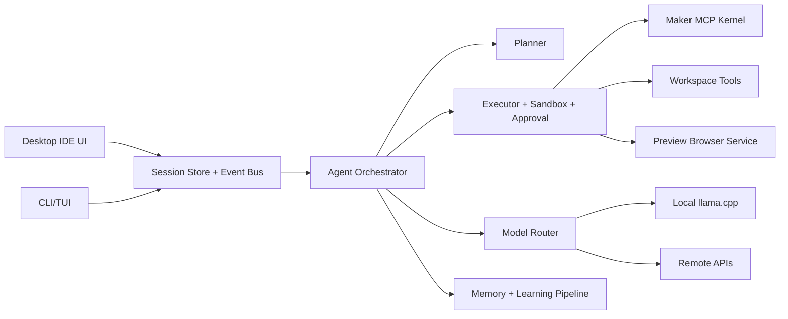

# TTMEvolve Agent IDE Redesign

Date: 2026-06-22

## Verdict

The current direction is partly right, but the architecture is still too demo-shaped. Electron + React + Python runtime is acceptable for a local desktop IDE, and the Maker MCP-first direction is correct. The weak point is that the product still exposes raw runtime events instead of a mature agent workbench, and the local model path proves the model can load but does not yet prove reliable agent behavior.

## Evidence From Current Runtime

The GUI startup logs show the local runtime really starts:

- `D:\CC\TTMEvolve\.venv\Scripts\python.exe` is selected.
- `scripts\bootstrap.py` reports the local model is ready at `models\MiniCPM5-1B-Q4_K_M.gguf`.
- Electron creates the Python `AppServer`.
- llama.cpp emits `Loading weights: 100%`.
- llama.cpp later emits `llama_context: n_ctx_seq (8192) < n_ctx_train (131072)`.

So the next problem is not "package llama.cpp someday"; it is "make local inference observable, constrained, and useful." The UI must show provider, model path, load state, token stats, last call latency, and raw output only in a debug drawer.

## Lessons From Mature Agents

Claude Code positions itself as an agentic coding tool that can read code, edit files, run commands, and integrate with developer tools across terminal, IDE, desktop, and browser surfaces. Its docs also emphasize permission modes, sessions, context window management, prompt caching, and instructions/memory. Source: https://code.claude.com/docs/en/overview

OpenAI Codex is explicitly a local coding agent, with CLI, IDE, and desktop app surfaces. The important lesson is not just "have a chat"; it is a local agent core with file edits, command execution, diffs, sandboxing, and approvals as first-class surfaces. Source: https://github.com/openai/codex

OpenCode exposes the same core across terminal, desktop app, IDE extension, web, SDK/server, providers, models, rules, permissions, MCP servers, LSP servers, custom tools, and plugins. The lesson for TTMEvolve is to separate the runtime kernel from any single UI. Source: https://opencode.ai/docs

Cursor's Plan Mode, rules, and MCP docs point toward a product shape where planning, context rules, tool integrations, and edit review are user-visible. Source: https://cursor.com/docs/agent/plan-mode

Recent coding-agent failure research is a useful warning: real users push back most often when agents misread projects, misinterpret intent, violate constraints, execute poorly, or report progress inaccurately. TTMEvolve should treat transparent progress, evidence, and recovery as core UI, not decoration. Source: https://arxiv.org/abs/2605.29442

## Target Architecture

## Required Refactor

1. Runtime kernel: keep one canonical agent runtime used by GUI, CLI, and future IDE extensions. GUI should not own agent logic.
2. Session/event model: events need typed states: `planning`, `waiting_for_approval`, `running_tool`, `editing`, `verifying`, `done`, `failed`. Raw ReAct text belongs behind a debug drawer.
3. Agent workbench: replace the chat-event feed with a task header, plan checklist, current action, tool timeline, diff/review panel, token meter, and runtime health strip.
4. Tool/MCP kernel: Maker MCP should be a promoted tool group with health, version, discovered tools, last call, failure reason, and retry.
5. Local model reliability: add constrained JSON action generation or deterministic repair/fallback. Parse errors must be visible in debug logs but should not become the normal workflow.
6. Layout system: resizable split panes and collapsible rails are baseline IDE behavior. The UI should persist layout state locally.
7. Browser preview: keep Playwright in one worker thread and expose health, current URL, screenshot age, console logs, and navigation errors.
8. Evolution loop: self-evolution must operate on recorded sessions, test outcomes, and validated patches. It should not silently mutate runtime code.

## ADR 001: Keep Electron, But Treat It As A Shell

Decision: keep Electron for now.

Rationale: Electron can provide custom title bars, embedded panes, local filesystem access through IPC, and a coherent desktop shell. The previous limitation was implementation, not Electron itself.

Consequence: Python remains the runtime authority. Electron owns windowing and rendering only.

## ADR 002: Move From ReAct Feed To Agent Workbench

Decision: user-facing UI should show structured task progress, not every thought/action event.

Rationale: mature tools make progress legible: plan, edits, approvals, verification, result. Raw event streams are useful for debugging but erode trust when presented as the main product surface.

Consequence: `useBackend` should normalize events into task state, while preserving raw events in a collapsible log.

## ADR 003: No Mock Fallback In Normal GUI

Decision: production GUI must fail loudly if local or configured remote model is unavailable.

Rationale: mock fallback hides the exact failures the user needs to see at this stage.

Consequence: mock stays test-only or explicit developer mode.

## Migration Plan

Phase 1: IDE usability baseline.
Resizable/collapsible panes, persistent layout, preview health, local model health, token meter.

Phase 2: Agent workbench.
Normalize events into plan/status/tool/diff/result. Keep raw logs hidden behind debug.

Phase 3: Local model reliability.
Constrained action JSON, deterministic repair, model health endpoint, per-call trace files.

Phase 4: Runtime kernel cleanup.
Unify GUI/CLI execution paths, typed tool registry, Maker MCP status surface, session replay.

Phase 5: Self-evolution with gates.
Only evolve from saved trajectories plus tests. Every generated improvement must produce a patch, verification result, and rollback point.
