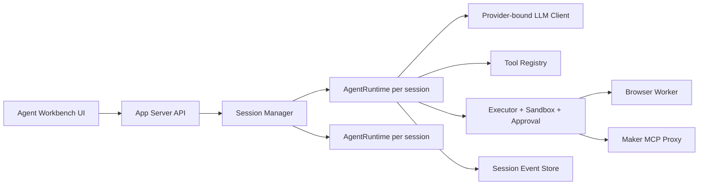

# TTMEvolve Code Review And Roadmap - 2026-06-22

## Executive Summary

The current product shape is right: API-first LLM runtime, Electron cockpit, local project IDE, shared browser service, and persistent session/event history. The principal contradiction is no longer "can the model run"; it is "can a user understand, trust, and recover an agent run while the runtime stays deterministic."

This review therefore prioritizes runtime isolation, event semantics, prompt/action reliability, and UI workbench structure over more raw local llama.cpp tuning.

## Findings

### P0 - Shared Agent Runtime Was Mutated By Concurrent Sessions

`AppServer` kept one `TapMakerAgent` and replaced its LLM, event sink, and approval callbacks at session start. If two GUI sessions ran at the same time, events and approvals could cross sessions, and one session could silently switch the other session's provider.

Status: upgraded from temporary serialization to session-scoped `TapMakerAgent` instances. Long term, keep refining this into a smaller explicit `AgentRuntime` class.

### P0 - Recoverable ReAct Errors Looked Fatal In The GUI

`ReActLoop` emits `error` events for tool validation and tool execution failures that the model can recover from. The frontend closed the SSE stream on every `error`, so the UI could show failure while the backend was still iterating.

Status: fixed in `useBackend.ts`; only fatal/done errors close the stream.

### P1 - Session LLM Reconfiguration Broke Injected Test Runtimes

`run_session()` recreated the LLM from config even when no session override was provided. This broke injected `MockLLM` flows and made tests dependent on real API config.

Status: fixed. LLM runtime is only reconfigured when a session explicitly provides provider/model/base URL/API key.

### P1 - Unconfigured API Provider Could Leave Session Running Forever

If provider creation failed before the main run `finally`, the session was marked done in memory but not persisted with a terminal status and no final `status.done` event was emitted.

Status: fixed. Initialization failures now persist as `error` and emit a terminal status event.

### P1 - SQLite Event Store Needed Multi-Thread Hardening

The session/event store is used by threaded HTTP/SSE code. It previously relied on default SQLite pragmas.

Status: improved with foreign keys, busy timeout, WAL mode, and normal synchronous mode.

### P2 - Windows Build And Test Ergonomics Are Uneven

`npm run build:frontend` at the root can fail on Windows because `vite` is resolved from the wrong package context. `npm --prefix frontend run build` works. The local `.venv` can also point to an unavailable Python, so verification should prefer a repaired project venv or documented bundled Python fallback.

Status: documented as follow-up.

## Architecture Target

Key direction: make session state explicit and isolated. The UI should consume a normalized workbench state, not raw ReAct events as the primary UX model.

## Roadmap

### Phase 1 - Runtime Determinism

- Extract `AgentRuntime` from the current session-scoped `TapMakerAgent` construction so each session owns only the required LLM, callbacks, ReAct state, executor, and memory budget state.
- Keep shared services explicit: browser worker, asset service, session store, Maker MCP client pool.
- Add session cancellation and timeout.
- Add tests for two concurrent sessions, provider isolation, and approval isolation.

### Phase 2 - Structured Agent Workbench

- Status: initial `AgentWorkbenchState` exists in the frontend and is rendered as a compact run-state panel above the raw event timeline.
- Introduce backend event categories: `info`, `recoverable_error`, `fatal_error`, `approval`, `tool_call`, `artifact`, `verification`.
- Build frontend state normalization: plan, current step, tool timeline, diffs/artifacts, token meter, debug drawer.
- Cap or virtualize long message/event lists.
- Make final answer and verification result visually distinct from debug trajectory.

### Phase 3 - Action Reliability

- Replace free-form `think -> choose_action` with constrained action JSON and small action prompts.
- Add local repair rules before calling the LLM again for common schema errors.
- Rank tools by task intent and only expose the top relevant subset to the action prompt.
- Measure parse-failure rate, tool-failure rate, and successful-task rate.

### Phase 4 - Performance Budget

- Track p50/p95 latency for LLM calls, tool calls, filesystem scans, browser actions, and SSE persistence.
- Cache tool schema strings and provider model hints.
- Add pagination/limits to asset scans and file tree reads.
- Move large previews and browser screenshots to streaming or cached artifact files.

### Phase 5 - Product Hardening

- Repair root build scripts for Windows workspace layout.
- Provide a one-click environment doctor: Python, Node, Playwright, Maker MCP, provider key status.
- Add crash-safe session resume semantics: terminal sessions replay; interrupted sessions show "restart from checkpoint."
- Define release gates: frontend build, Python compile, session-store tests, GUI flow tests, provider isolation smoke.

## Near-Term Development Order

### Completed Follow-Up - Maker Cockpit Usability Pass

- Default preview now opens the TapTap Maker web app at `https://maker.taptap.cn/` in browser mode.
- Chat input remains usable during an active run; additional user messages are queued and executed in order.
- The lower-left add-file button now opens the Electron native file picker, with a browser file input fallback for web/dev mode.
- Chat, file tree, and asset panes expose visible scrollbars and stable overflow behavior.
- The collapsed file/assets rail now shows explicit `文档` and `素材` buttons instead of a thin vertical label.
- The static three-layer block has been replaced by a real `AgentWorkbenchState` fed by backend layer/tool events.

### Completed Follow-Up - Runtime Reliability Pass

- Session-scoped agents replaced the temporary shared-runtime serialization.
- Tool selection is now ranked and capped per iteration before prompting the LLM.
- API LLM action prompts now use constrained JSON with a short repair fallback instead of large free-form action prompts.
- ReAct emits `tool_selection` events so the UI can show which tools are being considered.
- `TapMakerAgent` emits `layer` events for Agent, Runtime, and Learning phases, making the three-layer architecture observable.

### Next Development Order

1. Extract a lean `SessionRunner`/`AgentRuntime` so session runtime construction no longer needs a full `TapMakerAgent` object.
2. Add cancellation, timeout, and explicit queue controls for frontend queued messages.
3. Promote Maker MCP into a first-class tool group with health, version, discovered tools, last call, failure reason, and retry.
4. Add p50/p95 latency metrics for first token, LLM calls, tool calls, Maker MCP calls, browser actions, and task gaps.
5. Add progressive loading: paginated file tree/assets, virtualized event log, lazy preview thumbnails, and deferred large metadata scans.
6. Add a skill compatibility bridge that imports/exports Claude Code instructions, Codex skills, OpenCode plugins/tools, and TTMEvolve canonical skills through one schema.
